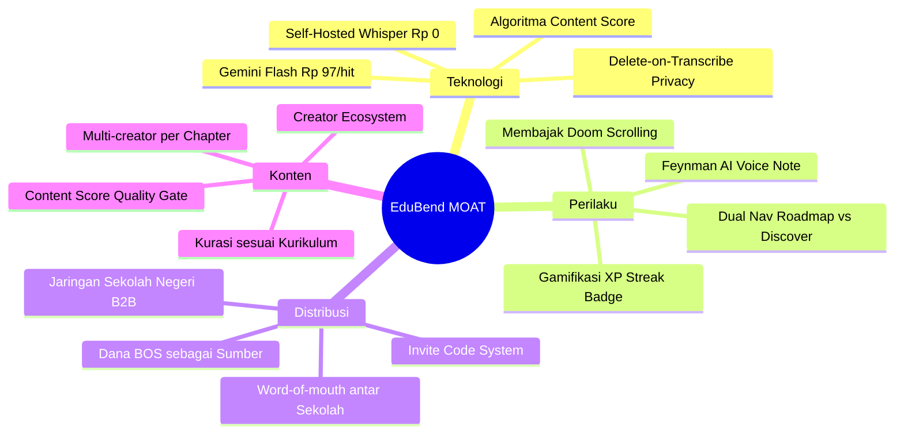
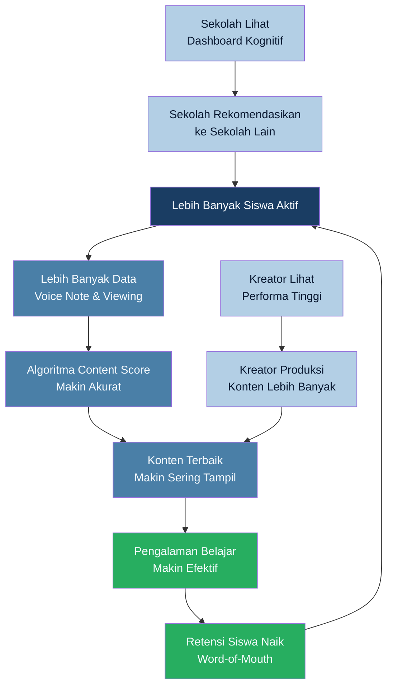

# 📋 BUSINESS MODEL CANVAS (BMC) — EduBend

> **Gamified Educational Doom Scrolling + Demokratisasi Feynman AI**
> Platform pembelajaran berbasis AI yang membajak kebiasaan *doom scrolling* siswa menjadi aktivitas belajar mikro yang terstruktur, terverifikasi, dan terjangkau secara inklusif.

---

## 🗺️ Visual BMC Overview

```mermaid
block-beta
    columns 5

    block:KP:1
        A["🤝 KEY PARTNERS<br/>• Dinas Pendidikan Daerah<br/>• Sekolah Negeri (Kepsek)<br/>• Content Creator Edukasi<br/>• Google (Gemini via OpenRouter)<br/>• Meta/OpenAI (Whisper OS)<br/>• Cloudflare Stream"]
    end
    block:KAKR:1
        B["⚙️ KEY ACTIVITIES<br/>• Platform Dev (Laravel, Flutter)<br/>• Operasi Async AI Pipeline<br/>• Sosialisasi & Kemitraan Sekolah<br/>• Kurasi & Insentif Kreator"]
        space
        C["🏗️ KEY RESOURCES<br/>• Algoritma Content Selection<br/>• Pipeline AI Feynman (Whisper/Gemini)<br/>• Tech Stack (Flutter, Laravel)<br/>• 2 Devs (AI Vibe Coding)<br/>• CapEx Awal & Staged OpEx"]
    end
    block:VP:1
        D["💎 VALUE PROPOSITIONS<br/>• Gamified Doom Scrolling Video<br/>• Checkpoint Voice Note (Feynman AI)<br/>• Dual Nav (Roadmap vs Discover)<br/>• Flat-Rate Dana BOS Rp 400rb/bln<br/>• B2B Dashboard Analitik Guru<br/>• Creator Fund & Gift RPM"]
    end
    block:CRCH:1
        E["❤️ CUSTOMER RELATIONSHIPS<br/>• Siswa: Automated & Gamified (Streak/XP)<br/>• Sekolah: Dedicated CS & Training<br/>• Creator: Community Support Dashboard"]
        space
        F["📢 CHANNELS<br/>• Flutter Mobile App (iOS/Android)<br/>• Next.js Web Admin Dashboard<br/>• Invite Code System (B2B)<br/>• Direct B2B Sales (Dinas/Kepsek)"]
    end
    block:CS:1
        G["👥 CUSTOMER SEGMENTS<br/>• Siswa Gen Z & Alpha (12-18 thn)<br/>• Sekolah Negeri (Dana BOS)<br/>• Creator Edukasi (Guru & Tutor)"]
    end

    block:COST:3
        H["💸 COST STRUCTURE<br/>• CapEx Rp 35.5jt (2 Devs, UI/UX, Legal, Cold Start)<br/>• COGS/Siswa/Bulan: B2B Rp 7.820, B2C Gratis Rp 1.897<br/>• OpEx Bulanan Staged: T1 Rp 800k, T2 Rp 4.55jt, T3 Rp 9.9jt"]
    end
    block:REV:2
        I["💰 REVENUE STREAMS<br/>• B2B SaaS Flat Rate: Rp 400rb/sekolah/bulan (Dana BOS)<br/>• B2C Ad-Supported: ~Rp 1.920/siswa/bulan<br/>• B2C Premium: Rp 19.000/siswa/bulan (Unlimited AI)<br/>• Creator Revenue Share (30% Platform / 70% Creator)"]
    end
```



---

## 1. 👥 CUSTOMER SEGMENTS — Siapa yang Kita Layani?

EduBend melayani **3 segmen utama** dalam ekosistem pembelajaran multi-sisi (*multi-sided platform*):

### 🎓 A. Siswa (Gen Z & Gen Alpha) — Pengguna Utama
- **Profil Demografis:** Pelajar SMP & SMA usia 12-18 tahun di seluruh Indonesia.
- **Ukuran Pasar:** Indonesia memiliki **~56 juta siswa aktif** di jenjang pendidikan dasar dan menengah (Data Kemendikbud RI).
- **Psikografis & Pain Points:**
  1. Mengalami **adiksi doom scrolling** video pendek berdurasi <1 menit yang memicu fragmentasi perhatian dan penurunan konsentrasi belajar (*Jurnal Basicedu Vol. 6*).
  2. Terjebak dalam **"ilusi kepintaran semu" (*illusion of competence*)** — merasa paham setelah menonton video tanpa mampu menerapkan konsep (*AntaraNews*).
  3. **Terhalang biaya** les privat 1-on-1 yang berkisar Rp 150.000 - Rp 400.000+ per sesi (*Gurulesprivate.co.id*), sehingga tidak mampu mendapatkan bimbingan interaktif berkualitas.
  4. Tervalidasi oleh **PISA 2022**: 82% anak usia 15 tahun di Indonesia tidak menguasai matematika dasar dengan baik.

### 🏫 B. Sekolah Negeri (Institusi / B2B) — Pelanggan Berbayar Utama
- **Profil:** Sekolah negeri jenjang SMP & SMA di seluruh Indonesia yang memiliki alokasi **Dana BOS** (*Biaya Operasional Sekolah*).
- **Pain Points:**
  1. Membutuhkan **alat evaluasi kognitif** yang lebih canggih dari soal pilihan ganda konvensional.
  2. Tidak memiliki dashboard pemantauan pemahaman siswa secara real-time.
  3. Terbatas anggaran — tetapi Dana BOS memungkinkan langganan flat-rate yang terjangkau.
- **Nilai Strategis:** Sekolah menjadi **jalur akuisisi siswa massal** (satu kontrak sekolah = ratusan siswa aktif otomatis).

### 🎬 C. Content Creator Edukasi — Penyedia Konten
- **Profil:** Guru, tutor independen, kreator YouTube/TikTok edukasi yang sudah memiliki keahlian mengajar.
- **Pain Points:**
  1. Tidak memiliki wadah monetisasi terstruktur yang dikurasi sesuai kurikulum resmi.
  2. Konten mereka di platform sosial media tidak terukur dampak edukasinya.
- **Nilai Strategis:** Kreator menjadi **engine konten** tanpa biaya SDM internal bagi platform.

---

## 2. 💎 VALUE PROPOSITIONS — Apa yang Kita Tawarkan?

EduBend menawarkan **proposisi nilai unik (UVP)** yang berbeda secara fundamental dari seluruh platform EdTech konvensional di Indonesia:

### 🎯 Tagline UVP:
> **"Kami membajak *doom scrolling*, menghentikan ilusi kepintaran, dan mendemokratisasi tutor AI untuk seluruh pelajar Indonesia."**

### Untuk Siswa:

| # | Value Proposition | Diferensiasi dari Kompetitor |
|---|---|---|
| 1 | **Gamified Educational Doom Scrolling** — Belajar via feed video vertikal TikTok-style yang terstruktur sesuai kurikulum resmi | Kompetitor (Ruangguru, Zenius) masih mengandalkan video 15-60 menit yang memicu *cognitive overload* |
| 2 | **Checkpoint Voice Note + Feynman AI** — Siswa wajib *menjelaskan ulang* materi secara lisan. AI menganalisis pemahaman konseptual, bukan sekadar hafalan | Tidak ada EdTech Indonesia yang melakukan **asesmen lisan berbasis AI** sebagai *unlock gate* |
| 3 | **Dual Navigation: Roadmap 📚 vs Discover 🔥** — Mode belajar terstruktur *dan* mode eksplorasi santai ala TikTok "Following vs For You" | Meningkatkan retensi — siswa yang bosan belajar bisa switch ke mode discover tanpa keluar aplikasi |
| 4 | **100% Gratis (Ad-Supported) atau Premium Rp 19.000/bulan** — Akses belajar tanpa hambatan ekonomi | Bimbel premium berkisar jutaan rupiah; EduBend meratakan akses kognitif secara radikal |
| 5 | **Gamifikasi Lengkap** — XP, streak, badge, leaderboard, animasi Lottie | Membuat belajar seketagih gaming |

### Untuk Sekolah (B2B):

| # | Value Proposition |
|---|---|
| 1 | **Dashboard Analitik Kognitif Guru** — Lihat pemahaman konseptual setiap siswa secara real-time, termasuk *weak topics* dan dropout rate per chapter |
| 2 | **Harga Sangat Terjangkau: Flat Rp 400.000/bulan** — Sesuai kemampuan anggaran Dana BOS, satu harga untuk seluruh siswa |
| 3 | **Siswa Sekolah Mendapat Akses Gratis** — Cukup satu invite code sekolah, seluruh siswa bisa belajar tanpa biaya pribadi |
| 4 | **Kurikulum Terstruktur** — Roadmap disusun sesuai kurikulum resmi, bukan konten random |

### Untuk Content Creator:

| # | Value Proposition |
|---|---|
| 1 | **Monetisasi Terstruktur ala TikTok** — Creator Fund (RPM Rp 4.000/1.000 tayangan), Virtual Gifting "Saweran Pintar", dan Premium Series paywall |
| 2 | **Kualitas > Viralitas** — Algoritma memilih kreator berdasarkan **skor pemahaman siswa (70% bobot)**, bukan sekadar engagement kosong |
| 3 | **Data Performa Konten** — Dashboard views, completion rate, dan rata-rata skor voice note per konten |

---

## 3. 📢 CHANNELS — Bagaimana Kita Menjangkau Pelanggan?

### Kanal Distribusi Produk

| Channel | Platform | Target Pengguna | Keterangan |
|---|---|---|---|
| **📱 Mobile App (Flutter)** | Android & iOS | Siswa | TikTok-style feed, voice note recording, gamifikasi — kanal utama pengalaman belajar |
| **🌐 Web Admin Dashboard (Next.js)** | Browser Desktop | Developer & Creator | Manajemen roadmap, moderasi konten, analytics — kanal operasional |
| **🔗 Invite Code System** | In-App | Semua Role | Distribusi akses beta terkontrol — sekolah mitra mendapat bulk invite code |

### Kanal Akuisisi (Go-to-Market)

| Fase | Channel Akuisisi | Taktik |
|---|---|---|
| **Beta (Bulan 1-2)** | Direct sales ke Dinas Pendidikan & Kepala Sekolah | Presentasi pilot project, demo live dashboard analytics kognitif guru |
| **Kemitraan Awal (Bulan 3-5)** | Sosialisasi Dinas Pendidikan daerah | Workshop gratis untuk guru, pameran EdTech, demo penggunaan Dana BOS |
| **Growth (Bulan 6+)** | Word-of-mouth antar sekolah + media sosial organik | Testimoni guru & siswa, konten viral dari kreator, referral antar kepala sekolah |
| **B2C Mandiri** | App Store, Google Play, media sosial | SEO, ASO, influencer edukasi, TikTok ads |

---

## 4. ❤️ CUSTOMER RELATIONSHIPS — Bagaimana Hubungan dengan Pelanggan?

### Tipe Hubungan per Segmen:

| Segmen | Tipe Hubungan | Implementasi |
|---|---|---|
| **Siswa** | **Automated + Gamified** | Streak reminder notification, XP milestone alert, AI feedback otomatis per voice note, progress dashboard personal |
| **Sekolah (B2B)** | **Dedicated Personal Assistance** | Onboarding tatap muka, pelatihan guru, dedicated CS, laporan kognitif bulanan |
| **Creator** | **Community + Self-Service** | Creator Dashboard self-service, feedback AI otomatis, notifikasi performa konten, creator fund transparan |

### Strategi Retensi Kunci:

```
┌─────────────────────────────────────────────────────────────┐
│                    RETENTION FLYWHEEL                        │
│                                                             │
│  Siswa belajar → Selesaikan chapter → Dapat XP & Streak    │
│       ↑                                            ↓        │
│  Switch ke Discover ← Bosan?     Ya → Temukan topik baru   │
│       ↓                                            ↓        │
│  Enroll roadmap baru ← ────────── Tertarik topik           │
│       ↓                                                     │
│  Kembali ke Tab Roadmap → Belajar lagi → LOOP ♻️            │
└─────────────────────────────────────────────────────────────┘
```

- **Dual Navigation Mode** mencegah siswa keluar dari app saat bosan (*churn prevention*)
- **Streak system** membangun kebiasaan harian (inspirasi Duolingo)
- **Voice note checkpoint** memberikan rasa pencapaian autentik (*mastery feeling*)

---

## 5. 💰 REVENUE STREAMS — Dari Mana Uang Masuk?

EduBend mengoperasikan **Model Bisnis Hibrida (Hybrid Revenue Model)** dengan 3 jalur pendapatan yang saling melengkapi:

### 🏛️ Stream 1: B2B SaaS Flat Rate — Sekolah Negeri (Pendapatan Utama)

| Parameter | Nilai |
|---|---|
| **Harga** | **Rp 400.000 / sekolah / bulan** (flat, unlimited siswa) |
| **Sumber Anggaran Pelanggan** | Dana BOS (Biaya Operasional Sekolah) — tidak membebani kantong siswa |
| **Value yang Diterima** | Dashboard analitik kognitif guru + akses gratis siswa via invite code sekolah |
| **Margin Kontribusi** | **Rp 170.000 / sekolah / bulan** (HPP Rp 230.000, asumsi 25-30 DAU per sekolah) |
| **Frekuensi** | Recurring bulanan (kontrak semester/tahunan) |

> 💡 **Mengapa B2B Sekolah Negeri?** Dana BOS bersifat flat-rate dan perizinannya mudah — tidak memerlukan approval rumit dari orang tua siswa. Satu keputusan kepala sekolah = ratusan siswa aktif.

### 📺 Stream 2: B2C Ad-Supported (Skala Volume)

| Parameter | Nilai |
|---|---|
| **Harga untuk Siswa** | **Rp 0 (100% gratis)** |
| **Model Monetisasi** | Iklan video pendek interstitial (*Duolingo-style*, eCPM Indonesia ~Rp 16/tayangan) |
| **Kuota Gratis** | 15 checkpoint voice note AI per bulan |
| **Pendapatan per Siswa** | ~Rp 1.920/bulan (120 tayangan iklan × Rp 16) |
| **HPP per Siswa** | ~Rp 1.897/bulan (API + Creator Fund) |
| **Surplus Bersih** | **+Rp 23/siswa/bulan** — siswa gratisan tetap menghasilkan surplus kecil! |

### ⭐ Stream 3: B2C Premium Subscription (High Margin)

| Parameter | Nilai |
|---|---|
| **Harga** | **Rp 19.000 / siswa / bulan** |
| **Benefit** | Bebas iklan, akses penuh unlimited checkpoint AI, fitur eksklusif |
| **HPP** | ~Rp 19.429/bulan (termasuk payment gateway Rp 3.000 + bagi hasil kreator 30%) |

### 🎨 Stream 4: Creator Economy Revenue Share (Ancillary)

| Sub-Stream | Mekanisme | Potensi |
|---|---|---|
| **Premium Series Paywall** | Kreator jual modul eksklusif Rp 15.000/beli, bagi hasil **30% platform : 70% kreator** | Rp 4.500/transaksi untuk platform |
| **Virtual Gifting "Saweran Pintar"** | Siswa beri gift virtual menggunakan EduCoins gratis dari belajar | Subsidi dari pendapatan iklan |

### 📊 Proyeksi Revenue Tahun Pertama

| Indikator | Nilai |
|---|---|
| **Total Revenue Tahun 1** | **Rp 439.000.000** |
| **Total Laba Bersih (EBT) Tahun 1** | **Rp 149.305.000** |
| **ROI terhadap CapEx** | **420,58%** |
| **ROI terhadap Total Investasi** | **124,37%** |
| **Jumlah Sekolah di Bulan 12** | 180 sekolah mitra |

---

## 6. 🏗️ KEY RESOURCES — Aset Kunci yang Dimiliki

### 🧠 A. Sumber Daya Intelektual

| Resource | Deskripsi | Keunggulan Kompetitif |
|---|---|---|
| **Algoritma Content Selection "TikTok Edukasi"** | Formula: `70% Avg Voice Note Score + 20% Completion Rate + 10% Rewatch Rate` | Memilih kreator berdasarkan **dampak pemahaman siswa**, bukan sekadar engagement — unik di dunia EdTech |
| **Pipeline AI Feynman** | Self-Hosted Whisper (STT gratis) → Gemini 1.5 Flash via OpenRouter (Rp 97/evaluasi) → LLM Semantic Scoring | HPP AI **95% lebih murah** dari arsitektur konvensional (OpenAI API langsung) |
| **Sistem Privasi "Delete-on-Transcribe"** | Audio langsung dihapus setelah transkripsi — Rp 0 biaya penyimpanan, 100% aman untuk data suara anak | Menghilangkan risiko kebocoran data anak sekaligus memangkas biaya S3 |

### 💻 B. Sumber Daya Teknologi

| Layer | Teknologi | Justifikasi |
|---|---|---|
| **Backend** | Laravel 11 (PHP 8.3), MySQL 8.0, Redis | Ekosistem terlengkap, built-in Queue untuk async AI processing |
| **Mobile** | Flutter 3.x (Dart) | Performa 60fps untuk TikTok-style feed, satu codebase Android + iOS |
| **Web Admin** | Next.js 14 (TypeScript) | Server components untuk dashboard data-heavy, chart optimal |
| **AI - STT** | Self-Hosted Whisper (model `base`/`tiny`) | **Gratis (Rp 0)** vs Whisper API yang berbayar |
| **AI - LLM** | Gemini 1.5 Flash via OpenRouter | **Rp 97/evaluasi** vs GPT-4o ~Rp 195/hit (hemat 95%) |
| **Video Hosting** | Cloudflare Stream + local caching di HP | Streaming performa tinggi dengan biaya rendah |

### 👥 C. Sumber Daya Manusia

| Peran | Jumlah | Pendekatan |
|---|---|---|
| Backend Developer (Dev 1) | 1 orang | AI-assisted *Vibe Coding* (Cursor Pro, GitHub Copilot) |
| Frontend & Mobile Dev (Dev 2) | 1 orang | AI-assisted *Vibe Coding* |
| UI/UX & Asset Designer | 1 orang (kontrak) | Lottie animations, branding, logo |

> 💡 **AI-Assisted Vibe Coding** memungkinkan tim hanya 2 developer untuk membangun seluruh platform dalam **5 minggu** — produktivitas setara tim konvensional 4-6 orang.

### 💵 D. Sumber Daya Finansial

| Parameter | Nilai |
|---|---|
| **Modal Awal (CapEx)** | **Rp 35.500.000** |
| **OpEx Bulan 1-2 (Beta)** | Rp 800.000/bulan |
| **OpEx Bulan 3-5 (Kemitraan Awal)** | Rp 4.550.000/bulan |
| **OpEx Bulan 6+ (Growth)** | Rp 9.900.000/bulan |

---

## 7. ⚙️ KEY ACTIVITIES — Aktivitas Utama yang Harus Dijalankan

### 🔧 A. Pengembangan & Pemeliharaan Platform

| Aktivitas | Detail | Timeline |
|---|---|---|
| Foundation & Auth | Setup Laravel, migrasi 11 tabel ERD, Sanctum auth, invite code system | Sprint 1 (Minggu 1) |
| Core: Roadmap & Konten | CRUD roadmap/chapter, upload video creator, AI auto-review moderasi | Sprint 2 (Minggu 2-3) |
| Student Flow & Voice Note | Enroll, feed TikTok-style, Whisper transkripsi, LLM scoring, error handling | Sprint 3 (Minggu 3-4) |
| Algoritma & Analytics | Content selection algorithm, dashboard analytics siswa/developer/creator | Sprint 4 (Minggu 5) |

### 📈 B. Akuisisi & Retensi Pelanggan

| Aktivitas | Fase | Target |
|---|---|---|
| **Sosialisasi Dinas Pendidikan** | Bulan 3+ | Presentasi ke kepala sekolah & dinas, workshop guru |
| **Onboarding Sekolah Mitra** | Ongoing | Setup invite code, pelatihan dashboard guru, pilot 1 bulan |
| **Kurasi & Insentif Kreator** | Bulan 1+ | Rekrut kreator awal, bayar flat-fee per video lolos kurasi (Dana Insentif Rp 3.000.000) |
| **Gamifikasi & Notifikasi** | Ongoing | Streak reminder, XP milestone, Lottie animations |

### 🤖 C. Operasi AI Pipeline

| Aktivitas | Detail |
|---|---|
| **Proses Voice Note Async** | Upload → Self-Hosted Whisper STT → Transkripsi → Gemini 1.5 Flash Scoring → Feedback ke siswa |
| **Content Moderation AI** | Creator upload video → AI review kesesuaian brief chapter → Auto approve/reject + developer final review |
| **Content Score Update** | Setiap ada data baru → update `content_scores` tabel → rekalkulasi algoritma TikTok |

---

## 8. 🤝 KEY PARTNERS — Mitra Strategis

| Partner | Peran | Nilai bagi EduBend |
|---|---|---|
| **Dinas Pendidikan Daerah** | Fasilitator akses ke jaringan sekolah negeri | Pintu masuk resmi ke sistem pendidikan negeri — legitimasi dan distribusi sekaligus |
| **Sekolah Negeri (Kepala Sekolah)** | Pelanggan B2B + distributor akses ke siswa | Satu kontrak = ratusan siswa aktif otomatis via invite code sekolah |
| **Content Creator Edukasi** | Penyedia konten pembelajaran berkualitas tinggi | Menghilangkan kebutuhan biaya SDM produksi konten internal |
| **Google (Gemini 1.5 Flash via OpenRouter)** | Penyedia API LLM evaluasi semantik | Biaya ultra-hemat Rp 97/evaluasi, dengan failover otomatis |
| **OpenRouter** | Agregator API AI (gateway) | Fleksibilitas switch antar model LLM tanpa lock-in vendor |
| **Cloudflare (Stream)** | Hosting & streaming video | CDN global performa tinggi untuk video pendek edukasi |
| **Meta/OpenAI (Whisper Open Source)** | Model Speech-to-Text open source | Self-hosted = **Rp 0** biaya transkripsi — kunci efisiensi HPP |
| **Pendirian PT Perorangan & HAKI** | Legalitas startup | Perizinan resmi untuk kontrak dengan sekolah negeri (Dana BOS memerlukan PT terdaftar) |

---

## 9. 💸 COST STRUCTURE — Struktur Biaya

### 📊 A. Biaya Tetap (Fixed Costs / CapEx — Sekali Bayar)

| No | Komponen | Anggaran |
|---|---|---|
| 1 | Backend Developer (Dev 1) — 5 minggu | Rp 12.000.000 |
| 2 | Frontend & Mobile Dev (Dev 2) — 5 minggu | Rp 12.000.000 |
| 3 | UI/UX & Asset Designer — Lottie, logo | Rp 4.000.000 |
| 4 | AI Tools & OpenRouter Credit awal | Rp 1.500.000 |
| 5 | Dana Insentif Awal Kreator (cold start) | Rp 3.000.000 |
| 6 | Pendirian PT Perorangan & HAKI | Rp 3.000.000 |
| **TOTAL CapEx** | | **Rp 35.500.000** |

### 📈 B. Biaya Variabel per Siswa (HPP / COGS)

| Komponen | B2B Sekolah | B2C Gratis | B2C Premium |
|---|---|---|---|
| Self-Hosted Whisper (STT) | Rp 0 | Rp 0 | Rp 0 |
| Gemini 1.5 Flash (LLM Scoring) | Rp 5.820 (60 checkpoint) | ~Rp 1.455 (15 checkpoint) | Variabel |
| Cloudflare Stream Video | Rp 1.600 | ~Rp 242 | Variabel |
| Creator Fund (RPM) | Rp 400 | Rp 200 | Termasuk bagi hasil |
| **Total HPP / siswa / bulan** | **Rp 7.820** | **~Rp 1.897** | **~Rp 19.429** |

### 📅 C. Biaya Operasional Bulanan (OpEx — Staged Scaling)

| Komponen | Tahap 1 (Bln 1-2) | Tahap 2 (Bln 3-5) | Tahap 3 (Bln 6+) |
|---|---|---|---|
| Infrastruktur Server & Cloud | Rp 150.000 | Rp 750.000 | Rp 1.800.000 |
| Layanan SaaS Pendukung | Rp 150.000 | Rp 300.000 | Rp 500.000 |
| Pemasaran & Sosialisasi Dinas | Rp 500.000 | Rp 1.500.000 | Rp 2.000.000 |
| Tim Pendukung (CS) & Cadangan | Rp 0 | Rp 2.000.000 | Rp 5.600.000 |
| **TOTAL OpEx Bulanan** | **Rp 800.000** | **Rp 4.550.000** | **Rp 9.900.000** |

> 💡 **Strategi *Staged Scaling*:** Biaya operasional naik bertahap seiring masuknya revenue, menjaga *cash runway* tetap panjang dan aman dari risiko kehabisan modal di awal.

---

## 📐 ANALISIS TAMBAHAN UNTUK PRESENTASI

### 🎯 Break-Even Point (BEP)

```
BEP Tahap 2 (OpEx Rp 4.550.000):
────────────────────────────────────
   Rp 4.550.000 ÷ Rp 170.000 = 27 Sekolah Mitra
   ✅ Dicapai di Bulan ke-5

BEP Tahap 3 (OpEx Rp 9.900.000):
────────────────────────────────────
   Rp 9.900.000 ÷ Rp 170.000 = 59 Sekolah Mitra
   ✅ Dicapai di Bulan ke-6
```

### 📈 Proyeksi Arus Kas Tahun Pertama

```
Bulan  Sekolah  Revenue        Laba Bersih      Status
─────  ───────  ─────────────  ───────────────  ──────────
 1-2   0 Beta   Rp 0           (Rp 1.600.000)   Beta Test
  3    5        Rp 2.500.000   (Rp 3.202.500)   Rugi Operasional
  4    15       Rp 7.500.000   (Rp 507.500)     Mendekati BEP
  5    30       Rp 15.000.000   Rp 3.535.000    ✅ BEP Tahap 2!
  6    60       Rp 29.000.000   Rp 5.270.000    ✅ BEP Tahap 3!
  7    80       Rp 39.000.000   Rp 10.660.000   Profit Stabil
  8    100      Rp 49.000.000   Rp 16.050.000   Scaling
  9    120      Rp 59.000.000   Rp 21.440.000   Scaling
 10    140      Rp 69.000.000   Rp 26.830.000   Scaling
 11    160      Rp 79.000.000   Rp 32.220.000   Scaling
 12    180      Rp 90.000.000   Rp 38.610.000   Target Tercapai
─────  ───────  ─────────────  ───────────────  ──────────
TOTAL  180      Rp 439.000.000  Rp 149.305.000  ROI 124,37%
```

### 🏆 Competitive Moat (Keunggulan Kompetitif yang Sulit Ditiru)



| Faktor | EduBend | Ruangguru | Zenius | Quipper |
|---|---|---|---|---|
| **Format Belajar** | Video pendek TikTok-style + Voice Note AI | Video panjang 15-60 menit | Video panjang + live class | Video panjang |
| **Metode Asesmen** | Lisan (Feynman AI Voice Note) | Pilihan ganda | Pilihan ganda | Pilihan ganda |
| **Harga Siswa** | Gratis (ad-supported) / Rp 19K/bln | Rp 500K - 4,5 juta/tahun | Rp 200K - 1,5 juta/tahun | Rp 200K+/tahun |
| **Harga B2B Sekolah** | Flat Rp 400K/bln (Dana BOS) | Paket enterprise mahal | Paket enterprise | Enterprise |
| **Asesmen Pemahaman** | ✅ Evaluasi konseptual lisan AI | ❌ Hanya PG ingatan | ❌ Hanya PG ingatan | ❌ Hanya PG |
| **Creator Ecosystem** | ✅ TikTok-style monetisasi | ❌ Konten in-house | ❌ Konten in-house | ❌ Konten in-house |

### 🔄 Flywheel Effect (Efek Roda Gila)



---

## 📋 RINGKASAN EKSEKUTIF BMC — Satu Halaman

| Blok BMC | Ringkasan |
|---|---|
| **Customer Segments** | Siswa SMP/SMA (56 juta), Sekolah Negeri (B2B pelanggan utama), Content Creator Edukasi |
| **Value Propositions** | Gamified Doom Scrolling + Feynman AI Voice Note + Dashboard Kognitif Guru + Gratis/Rp19K |
| **Channels** | Mobile App (Flutter), Web Admin (Next.js), Invite Code, Sosialisasi Dinas Pendidikan |
| **Customer Relationships** | Automated gamifikasi (siswa), Dedicated assistance (sekolah), Self-service + AI feedback (creator) |
| **Revenue Streams** | B2B SaaS Rp 400K/sekolah/bulan + B2C Ad-Supported + B2C Premium Rp 19K/bulan + Creator Revenue Share |
| **Key Resources** | Algoritma Content Score, AI Pipeline (Whisper + Gemini Flash), 2 Developer + AI Vibe Coding, Modal Rp 35,5 juta |
| **Key Activities** | Pengembangan platform 5 minggu, Akuisisi sekolah, Operasi AI pipeline, Kurasi konten kreator |
| **Key Partners** | Dinas Pendidikan, Sekolah Negeri, Content Creator, Google/OpenRouter, Cloudflare, Whisper Open Source |
| **Cost Structure** | CapEx Rp 35,5 juta + OpEx staged Rp 800K→Rp 9,9 juta/bln + HPP Rp 7.820/siswa B2B/bln |

---

## 📝 CATATAN VALIDASI DATA

> [!IMPORTANT]
> Seluruh angka keuangan dalam BMC ini telah di-*cross-validate* dengan dokumen [FINANCIAL_PLAN.md](file:///c:/laragon/www/project1/FINANCIAL_PLAN.md). Berikut hasil validasi:

| Data Point | Nilai di BMC | Nilai di Financial Plan | Status |
|---|---|---|---|
| CapEx Total | Rp 35.500.000 | Rp 35.500.000 | ✅ Konsisten |
| Harga B2B Sekolah | Rp 400.000/bln | Rp 400.000/bln | ✅ Konsisten |
| HPP B2B per Siswa | Rp 7.820/bln | Rp 7.820/bln | ✅ Konsisten |
| Margin Kontribusi per Sekolah | Rp 170.000/bln | Rp 170.000/bln | ✅ Konsisten |
| BEP Tahap 2 | 27 Sekolah | 27 Sekolah | ✅ Konsisten |
| BEP Tahap 3 | 59 Sekolah | 59 Sekolah | ✅ Konsisten |
| Revenue Tahun 1 | Rp 439.000.000 | Rp 439.000.000 | ✅ Konsisten |
| Laba Bersih Tahun 1 | Rp 149.305.000 | Rp 149.305.000 | ✅ Konsisten |
| ROI Total Investasi | 124,37% | 124,37% | ✅ Konsisten |
| Biaya Gemini per evaluasi | Rp 97 | Rp 97 | ✅ Konsisten |
| Harga Premium B2C | Rp 19.000/bln | Rp 19.000/bln | ✅ Konsisten |
| OpEx Tahap 1 | Rp 800.000/bln | Rp 800.000/bln | ✅ Konsisten |
| OpEx Tahap 3 | Rp 9.900.000/bln | Rp 9.900.000/bln | ✅ Konsisten |

> [!NOTE]
> Sumber data pendukung non-keuangan (masalah, riset, statistik) telah divalidasi terhadap [LATAR_BELAKANG.md](file:///c:/laragon/www/project1/LATAR_BELAKANG.md) yang memuat 10 referensi akademis dan jurnalistik, termasuk:
> - Harvard & MIT MOOC Study (completion rate 12.6%)
> - PISA 2022 (82% siswa Indonesia tidak menguasai matematika dasar)
> - Jurnal Basicedu Vol. 6 (fragmentasi perhatian akibat video pendek)
> - AntaraNews (ilusi kepintaran AI dalam pendidikan)
> - Biayales.id & Gurulesprivate.co.id (tarif bimbel jutaan rupiah)

---

> 📄 **Dokumen Pendukung BMC:**
> - [LATAR_BELAKANG.md](file:///c:/laragon/www/project1/LATAR_BELAKANG.md) — Riset & validasi masalah
> - [FINANCIAL_PLAN.md](file:///c:/laragon/www/project1/FINANCIAL_PLAN.md) — Rencana keuangan lengkap
> - [markdown.md](file:///c:/laragon/www/project1/markdown.md) — Alur sistem & fitur
> - [TECHSTACK.md](file:///c:/laragon/www/project1/TECHSTACK.md) — Arsitektur teknologi
> - [ERD.md](file:///c:/laragon/www/project1/ERD.md) — Desain database
> - [API.md](file:///c:/laragon/www/project1/API.md) — Kontrak API
> - [SPRINT.md](file:///c:/laragon/www/project1/SPRINT.md) — Timeline pengembangan
> - [WIREFRAME.md](file:///c:/laragon/www/project1/WIREFRAME.md) — Referensi visual UI
