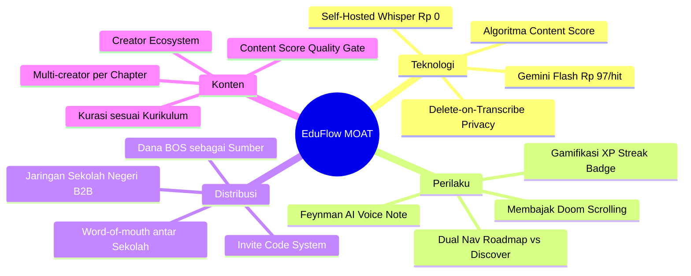
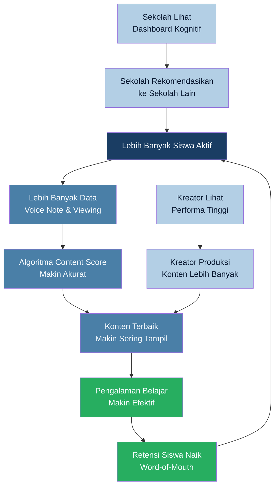

# BUSINESS MODEL CANVAS (BMC) - EduFlow

> **Gamified Educational Micro-learning + Demokratisasi Feynman AI**
> Platform pembelajaran berbasis AI yang mentransformasikan konsumsi media digital pasif siswa menjadi aktivitas belajar mikro yang terstruktur, terverifikasi, dan terjangkau secara inklusif.

---

## Visual BMC Overview

```mermaid
block-beta
    columns 5

    block:KP:1
        A["KEY PARTNERS<br/>• Dinas Pendidikan Daerah<br/>• Sekolah Negeri & Kepsek<br/>• Mitra Marketplace SIPLah<br/>• Content Creator Edukasi<br/>• Google (Gemini via OpenRouter)<br/>• RunPod (Whisper Serverless)<br/>• Kemenkumham (PT & HAKI)"]
    end
    block:KAKR:1
        B["KEY ACTIVITIES<br/>• Platform Dev (Laravel, Flutter)<br/>• Operasi Async AI Pipeline<br/>• Sosialisasi & Kemitraan Sekolah<br/>• Kurasi & Insentif Kreator"]
        space
        C["KEY RESOURCES<br/>• Algoritma Content Selection<br/>• Pipeline AI Feynman (Whisper/Gemini)<br/>• Tech Stack (Flutter, Laravel)<br/>• 2 Devs (AI Vibe Coding)<br/>• CapEx Awal & Staged OpEx"]
    end
    block:VP:1
        D["VALUE PROPOSITIONS<br/>• Gamified Micro-learning Video<br/>• Checkpoint Voice Note (Feynman AI)<br/>• Dual Nav (Roadmap vs Discover)<br/>• Flat-Rate Dana BOS Rp 400rb/bln<br/>• B2B Dashboard Analitik Guru<br/>• Legalitas & Akuntabilitas SIPLah"]
    end
    block:CRCH:1
        E["CUSTOMER RELATIONSHIPS<br/>• Siswa: Automated & Gamified (Streak/XP)<br/>• Sekolah: Dedicated CS & Onboarding<br/>• Creator: Community Support Dashboard"]
        space
        F["CHANNELS<br/>• Flutter Mobile App (iOS/Android)<br/>• Next.js Web Admin Dashboard<br/>• Portal SIPLah & ARKAS (B2B)<br/>• Direct B2B Pitching (Dinas/Kepsek)"]
    end
    block:CS:1
        G["CUSTOMER SEGMENTS<br/>• Siswa Gen Z & Alpha (12-18 thn)<br/>• Sekolah Negeri (Penerima BOS)<br/>• Creator Edukasi (Guru & Tutor)"]
    end

    block:COST:3
        H["COST STRUCTURE<br/>• CapEx Rp 35.5jt (Tim Founder, Legal PT/HAKI via OSS/DJKI)<br/>• COGS/Siswa/Bulan: B2B Rp 7.820, B2C Gratis Rp 1.897, Premium Rp 19.429<br/>• OpEx Bulanan Staged: T1 Rp 800k, T2 Rp 4.55jt, T3 Rp 9.9jt (Kepatuhan UMK)"]
    end
    block:REV:2
        I["REVENUE STREAMS<br/>• B2B SaaS Flat Rate: Rp 400rb/sekolah/bulan (BOS via SIPLah)<br/>• B2C Ad-Supported: ~Rp 1.920/siswa/bulan (eCPM Rp 16)<br/>• B2C Premium: Rp 19.000/siswa/bulan (Tanpa Iklan)<br/>• Creator Revenue Share (30% Platform : 70% Creator)"]
    end
```



---

## 1. CUSTOMER SEGMENTS - Target Pasar dan Segmentasi

EduFlow melayani 3 segmen utama dalam ekosistem pembelajaran multi-sisi (multi-sided platform):

### A. Siswa (Gen Z & Gen Alpha) - Pengguna Utama
- **Profil Demografis:** Pelajar SMP & SMA usia 12-18 tahun di seluruh Indonesia.
- **Ukuran Pasar:** Indonesia memiliki ~56 juta siswa aktif di jenjang pendidikan dasar dan menengah (Data Kemendikbud RI).
- **Psikografis & Pain Points:**
  1. Mengalami adiksi konsumsi konten video pendek berdurasi singkat yang memicu fragmentasi perhatian siswa (Jurnal Basicedu Vol. 6).
  2. Terjebak dalam ilusi kompetensi (illusion of competence) - merasa paham setelah menonton video tanpa kemampuan menerapkan konsep (AntaraNews).
  3. Terhalang hambatan ekonomi untuk mengakses les privat 1-on-1 berkualitas (tarif konvensional berkisar Rp 150.000 - Rp 400.000+ per sesi).
  4. Rendahnya kompetensi dasar kognitif nasional berdasarkan data PISA 2022 (82% siswa usia 15 tahun tidak menguasai matematika dasar).

### B. Sekolah Negeri (Institusi / B2B) - Pelanggan Utama Berbayar
- **Profil:** Sekolah negeri jenjang SMP & SMA di seluruh Indonesia yang memiliki alokasi anggaran Dana BOS (Biaya Operasional Sekolah).
- **Pain Points:**
  1. Membutuhkan alat evaluasi kognitif digital yang komprehensif melampaui metode pilihan ganda konvensional.
  2. Ketiadaan infrastruktur dashboard pemantauan tingkat pemahaman siswa secara real-time.
  3. Keterbatasan anggaran pengadaan sistem teknologi informasi sekolah.
- **Nilai Strategis:** Sekolah berfungsi sebagai kanal akuisisi siswa dengan volume tinggi (satu kontrak sekolah mengonversi ratusan siswa aktif secara otomatis).

### C. Content Creator Edukasi - Penyedia Konten
- **Profil:** Guru, tutor independen, dan kreator konten edukatif di platform digital (YouTube/TikTok) dengan kompetensi pengajaran.
- **Pain Points:**
  1. Ketiadaan model monetisasi yang terstruktur dan terintegrasi dengan kurikulum resmi nasional.
  2. Kesulitan mengukur dampak edukasi dan efektivitas konten yang dipublikasikan di platform media sosial umum.
- **Nilai Strategis:** Kreator menjadi penyedia konten utama (content engine) tanpa membebani biaya produksi konten internal platform.

---

## 2. VALUE PROPOSITIONS - Proposisi Nilai

EduFlow menawarkan proposisi nilai unik (UVP) yang membedakan platform ini dari EdTech konvensional:

### Tagline UVP:
> **"Mentransformasikan konsumsi media digital pasif menjadi aktivitas pembelajaran aktif yang terukur dengan demokratisasi bimbingan belajar berbasis AI."**

### Untuk Siswa:

| No | Value Proposition | Diferensiasi dari Kompetitor |
|---|---|---|
| 1 | **Micro-learning Feed Terstruktur** - Pembelajaran via video vertikal pendek yang diselaraskan dengan kurikulum resmi | EdTech konvensional menggunakan video panjang (15-60 menit) yang rentan memicu overload kognitif |
| 2 | **Checkpoint Voice Note & Feynman AI** - Evaluasi konseptual berbasis verbal. AI menganalisis tingkat pemahaman konseptual secara mendalam | Tidak ada kompetitor lokal yang menerapkan asesmen lisan berbasis AI sebagai prasyarat kelulusan chapter |
| 3 | **Navigasi Ganda: Roadmap vs Discover** - Menyediakan jalur belajar terstruktur dan eksplorasi minat bebas | Meminimalisir kejenuhan belajar dengan mempertahankan siswa tetap di dalam ekosistem platform |
| 4 | **Akses Inklusif (Ad-Supported & Premium Terjangkau)** - Opsi akses gratis dengan dukungan iklan atau premium seharga Rp 19.000/bulan | Layanan bimbingan belajar konvensional membebankan biaya tahunan bernilai jutaan rupiah |
| 5 | **Sistem Pembelajaran Tergamifikasi** - Penerapan mekanisme XP, streak harian, leaderboard, dan animasi interaktif | Meningkatkan loyalitas dan frekuensi penggunaan aplikasi secara organik |

### Untuk Sekolah (B2B):

| No | Value Proposition |
|---|---|
| 1 | **Dashboard Analitik Kognitif Guru** - Pemantauan real-time terhadap tingkat pemahaman siswa, identifikasi materi sulit, dan metrik retensi belajar |
| 2 | **Model Harga Flat-Rate (Rp 400.000/bulan)** - Fleksibilitas pembiayaan yang disesuaikan dengan kapasitas Dana BOS sekolah tanpa membatasi jumlah siswa |
| 3 | **Bulk Access untuk Sekolah Mitra** - Seluruh siswa mendapatkan akses gratis ke platform melalui kode undangan khusus sekolah |
| 4 | **Roadmap Terstruktur Kurikulum Nasional** - Penyelarasan konten dengan standar materi pembelajaran resmi pemerintah |

### Untuk Content Creator:

| No | Value Proposition |
|---|---|
| 1 | **Ekosistem Monetisasi Terstruktur** - Insentif melalui Creator Fund (eCPM Rp 4.000/1.000 views), Virtual Gifting, dan paywall Premium Series |
| 2 | **Algoritma Berbasis Dampak Pembelajaran** - Distribusi konten diutamakan berdasarkan skor pemahaman siswa (bobot algoritma 70%), bukan sekadar popularitas konten |
| 3 | **Dashboard Transparansi Kinerja Konten** - Akses data analitik lengkap terkait completion rate video dan skor evaluasi rata-rata penonton |

---

## 3. CHANNELS - Saluran Distribusi dan Akuisisi

### Kanal Distribusi Produk

| Channel | Platform | Target Pengguna | Keterangan |
|---|---|---|---|
| **Mobile App (Flutter)** | Android & iOS | Siswa | Antarmuka feed video pendek, perekaman voice note, dan gamifikasi |
| **Web Admin Dashboard (Next.js)** | Browser Desktop | Developer & Creator | Dashboard manajemen kurikulum, moderasi konten, dan analitik data |
| **Invite Code System** | In-App | Semua Peran | Sistem otentikasi akses terkontrol untuk kemitraan sekolah |

### Kanal Akuisisi (Go-to-Market)

| Fase | Channel Akuisisi | Taktik |
|---|---|---|
| **Beta (Bulan 1-2)** | Penjualan langsung (Direct Sales) ke Dinas Pendidikan & Sekolah | Presentasi proyek percontohan (pilot project) dan demo dashboard analitik guru |
| **Kemitraan Awal (Bulan 3-5)** | Sosialisasi formal tingkat daerah | Workshop pemanfaatan Dana BOS untuk digitalisasi evaluasi pembelajaran sekolah |
| **Growth (Bulan 6+)** | Pemasaran rujukan (Referral) & Organik | Kampanye testimoni keberhasilan guru dan rujukan antar-sekolah mitra |
| **B2C Mandiri** | App Store, Google Play, dan Media Sosial | Optimasi ASO/SEO, kampanye bersama kreator edukasi, dan iklan terarah |

---

## 4. CUSTOMER RELATIONSHIPS - Retensi dan Hubungan Pelanggan

### Tipe Hubungan per Segmen:

| Segmen | Tipe Hubungan | Implementasi |
|---|---|---|
| **Siswa** | **Automated & Gamified** | Pengingat otomatis berbasis streak harian, feedback AI instan pasca-evaluasi, dan visualisasi perkembangan belajar |
| **Sekolah (B2B)** | **Dedicated Personal Assistance** | Proses onboarding terpandu, pelatihan pemanfaatan dashboard untuk guru, dan pelaporan berkala |
| **Creator** | **Community & Self-Service** | Dashboard pengelolaan mandiri, notifikasi analitik performa konten, dan penyaluran dana transparan |

### Strategi Retensi Kunci:

```
┌─────────────────────────────────────────────────────────────┐
│                    RETENTION FLYWHEEL                        │
│                                                             │
│  Siswa belajar → Selesaikan chapter → Dapat XP & Streak    │
│       ↑                                            ↓        │
│  Switch ke Discover ← Bosan?     Ya → Temukan topik baru   │
│       ↓                                            ↓        │
│  Enroll roadmap baru ← ────────── Tertarik topik           │
│       ↓                                                     │
│  Kembali ke Tab Roadmap → Belajar lagi → Siklus Berkelanjutan│
└─────────────────────────────────────────────────────────────┘
```

- **Dual Navigation Mode** bertindak sebagai mekanisme retensi untuk mencegah churn saat kejenuhan belajar terdeteksi.
- **Streak System** diadopsi untuk membentuk rutinitas belajar harian yang konsisten.
- **Voice Checkpoint** memperkuat retensi melalui pencapaian belajar yang valid secara objektif.

---

## 5. REVENUE STREAMS - Struktur Pendapatan

EduFlow menggunakan Model Bisnis Hibrida (Hybrid Revenue Model) untuk memaksimalkan diversifikasi pendapatan dengan profitabilitas tinggi:

### Stream 1: B2B SaaS Flat Rate - Sekolah Negeri (Pendapatan Utama)

| Parameter | Nilai |
|---|---|
| **Harga** | **Rp 400.000 / sekolah / bulan** (Akses tak terbatas untuk siswa sekolah mitra) |
| **Sumber Anggaran Pelanggan** | Alokasi Dana BOS (Bantuan Operasional Satuan Pendidikan) |
| **Saluran Pembayaran** | Wajib Transaksi via **SIPLah** & Perencanaan via **ARKAS** |
| **Value yang Diterima** | Lisensi dashboard analitik kognitif guru + bulk invite code |
| **Margin Kontribusi** | **Rp 170.000 / sekolah / bulan** (HPP Rp 230.000, asumsi 25-30 DAU per sekolah) |
| **Frekuensi** | Pendapatan berulang bulanan (kontrak berbasis semester atau tahunan) |

**Justifikasi Strategis B2B Sekolah Negeri:** Pemanfaatan Dana BOS diatur legal dalam [Permendikbudristek No. 63 Tahun 2022](https://jdih.kemdikbud.go.id/detail_peraturan?main=3238). Model flat-rate ini hanya mengambil **1,45%** dari total rata-rata anggaran BOS tahunan sekolah menengah (~Rp 330jt/tahun), menjadikannya sangat terjangkau bagi sekolah dan memberikan stabilitas arus kas tinggi (*stable recurring revenue*) bagi platform.

### Stream 2: B2C Ad-Supported (Skala Volume)

| Parameter | Nilai |
|---|---|
| **Harga untuk Siswa** | **Rp 0 (Akses gratis terdukung iklan)** |
| **Model Monetisasi** | Iklan video pendek interstitial (eCPM estimasi regional Rp 16 per tayangan) |
| **Kuota Layanan** | Batasan 15 checkpoint evaluasi AI per bulan |
| **Pendapatan per Siswa** | ~Rp 1.920 / bulan (berdasarkan rata-rata 120 tayangan iklan per siswa) |
| **HPP per Siswa** | ~Rp 1.897 / bulan (akumulasi biaya API LLM dan kontribusi Creator Fund) |
| **Surplus Bersih** | **+Rp 23 / siswa / bulan** (pengguna non-bayar tetap menghasilkan surplus profitabilitas) |

### Stream 3: B2C Premium Subscription (High Margin)

| Parameter | Nilai |
|---|---|
| **Harga** | **Rp 19.000 / siswa / bulan** |
| **Benefit** | Bebas iklan, akses tanpa batas ke evaluasi AI, dan fitur belajar eksklusif |
| **HPP** | **Rp 19.429 / siswa / bulan** (Breakdown: Rp 3.000 PG [Midtrans/Xendit] + Rp 5.700 Kreator 30% + Rp 10.729 API Gemini/Cloudflare Stream) |

### Stream 4: Creator Economy Revenue Share (Ancillary)

| Sub-Stream | Mekanisme | Potensi Pendapatan |
|---|---|---|
| **Premium Series Paywall** | Modul pembelajaran berbayar Rp 15.000 (Bagi hasil: 30% platform : 70% kreator) | Rp 4.500 per transaksi sukses untuk platform |
| **Virtual Gifting** | Pemberian hadiah digital oleh siswa berbasis apresiasi konseptual | Mekanisme subsidi silang dari akumulasi pendapatan iklan platform |

### Proyeksi Pendapatan Tahun Pertama

| Indikator Keuangan | Nilai Target |
|---|---|
| **Total Revenue Tahun 1** | **Rp 439.000.000** |
| **Total Laba Bersih (EBT) Tahun 1** | **Rp 149.305.000** |
| **ROI terhadap CapEx** | **420,58%** |
| **ROI terhadap Total Investasi** | **124,37%** |
| **Target Sekolah Mitra (Bulan 12)** | 180 sekolah aktif |

---

## 6. KEY RESOURCES - Aset Strategis Utama

### A. Sumber Daya Intelektual

| Resource | Deskripsi | Keunggulan Kompetitif |
|---|---|---|
| **Algoritma Content Selection** | Formula distribusi konten: `70% Avg Voice Note Score + 20% Completion Rate + 10% Rewatch Rate` | Mengutamakan penyebaran video berdasarkan metrik kejelasan akademis, bukan viralitas kosong |
| **Pipeline AI Feynman** | Integrasi Whisper (STT) lokal dengan model Gemini 1.5 Flash via OpenRouter | Menghasilkan efisiensi HPP AI sebesar 95% dibanding model API proprietary standar |
| **Sistem Privasi Transkripsi** | Penghapusan otomatis file audio pasca-proses transkripsi verbal selesai | Menurunkan biaya komputasi penyimpanan (S3 storage) sekaligus menjamin kepatuhan data anak |

### B. Sumber Daya Teknologi

| Layer | Teknologi | Justifikasi Teknis |
|---|---|---|
| **Backend** | Laravel 11 (PHP 8.3), MySQL 8.0, Redis | Kecepatan pengembangan tinggi dengan dukungan sistem Queue bawaan untuk pemrosesan AI |
| **Mobile** | Flutter 3.x (Dart) | Antarmuka berkinerja tinggi (60 FPS) dengan satu basis kode untuk Android & iOS |
| **Web Admin** | Next.js 14 (TypeScript) | Struktur rendering cepat untuk data analitik kognitif guru yang masif |
| **AI - STT** | Self-Hosted Whisper (model base/tiny) | Mengurangi biaya operasional transkripsi menjadi Rp 0 (Zero Cost STT) |
| **AI - LLM** | Gemini 1.5 Flash via OpenRouter | Biaya operasional sangat rendah (~Rp 97 per evaluasi) dengan performa andal |
| **Video Hosting** | Cloudflare Stream + Local Caching | Optimasi kompresi video untuk bandwidth minimum pada perangkat siswa |

### C. Sumber Daya Manusia

| Peran | Status | Pendekatan Kerja |
|---|---|---|
| Backend Developer | **Tim Founder (Sweat Equity)** | AI-assisted software engineering (Vibe Coding methodology) |
| Frontend & Mobile Developer | **Tim Founder (Sweat Equity)** | AI-assisted software engineering (Vibe Coding methodology) |
| UI/UX & Asset Designer | **Tim Founder (Sweat Equity)** | Pengembangan aset visual, Lottie animation, dan identitas merek |

**Analisis Efisiensi SDM:** Seluruh pengembangan (Backend, Frontend/Mobile, UI/UX) dikerjakan sepenuhnya oleh tim founder (co-founder mahasiswa) — **zero outsourcing cost**. Metodologi AI-assisted Vibe Coding memungkinkan penyelesaian produk dalam 5 minggu dengan *actual cash out* hanya **Rp 7.500.000**.

### D. Sumber Daya Finansial

| Parameter Finansial | Alokasi Anggaran |
|---|---|
| **Modal Awal Pengembangan (CapEx)** | **Rp 35.500.000** |
| **OpEx Tahap 1 (Bulan 1-2: Fase Beta)** | Rp 800.000 / bulan |
| **OpEx Tahap 2 (Bulan 3-5: Kemitraan Awal)** | Rp 4.550.000 / bulan |
| **OpEx Tahap 3 (Bulan 6+: Fase Ekspansi)** | Rp 9.900.000 / bulan |

---

## 7. KEY ACTIVITIES - Aktivitas Utama

### A. Pengembangan dan Pemeliharaan Platform

| Aktivitas | Cakupan Teknis | Linimasa |
|---|---|---|
| Foundation & Auth | Konfigurasi Laravel, migrasi skema database ERD, Sanctum auth, invite code | Sprint 1 (Minggu 1) |
| Core: Roadmap & Konten | Fitur manajemen roadmap, unggahan video kreator, evaluasi kelayakan konten otomatis | Sprint 2 (Minggu 2-3) |
| Student Flow & Voice Note | Fitur pendaftaran kelas, pemrosesan audio Whisper, evaluasi Gemini, manajemen antrean | Sprint 3 (Minggu 3-4) |
| Algoritma & Analytics | Implementasi algoritma seleksi feed, integrasi dashboard grafik guru dan developer | Sprint 4 (Minggu 5) |

### B. Akuisisi dan Retensi Pelanggan

| Aktivitas | Tahapan Implementasi | Target Capaian |
|---|---|---|
| **Sosialisasi Dinas Pendidikan** | Mulai Bulan 3 | Kemitraan regional formal untuk menjangkau kelompok sekolah negeri |
| **Onboarding Sekolah Mitra** | Berkelanjutan | Aktivasi kode undangan dan sosialisasi pemanfaatan dashboard untuk guru mata pelajaran |
| **Kurasi & Insentif Kreator** | Mulai Bulan 1 | Akuisisi kreator konten awal dengan sistem insentif produksi modular (anggaran Rp 3.000.000) |
| **Optimasi Gamifikasi** | Berkelanjutan | Pemantauan retensi siswa berbasis durasi harian dan rasio penyelesaian checkpoint |

### C. Operasional Pipeline AI

| Aktivitas | Cakupan Proses |
|---|---|
| **Pemrosesan Asinkron Suara** | Siklus transkripsi audio lisan siswa via Whisper, pengiriman ke LLM Gemini Flash, dan pengembalian umpan balik |
| **Moderasi Konten Berbasis AI** | Pengecekan otomatis kesesuaian materi video dengan silabus chapter sebelum persetujuan tayang |
| **Pembaruan Algoritma Rekomendasi** | Rekalkulasi berkala tabel indeks konten berdasarkan skor efektivitas belajar siswa |

---

## 8. KEY PARTNERS - Kemitraan Strategis

| Partner | Peran Kemitraan | Dampak Strategis bagi Startup |
|---|---|---|
| **Dinas Pendidikan Daerah** | Fasilitator akses kebijakan regional | Legitimasi formal untuk penetrasi pasar B2B secara masif |
| **Sekolah Negeri & Kepala Sekolah** | Pengguna B2B dan validator lapangan | Menghilangkan hambatan pemasaran individual ke siswa (bulk acquisition) |
| **Content Creator Edukasi** | Penyedia konten kurikulum terkurasi | Efisiensi biaya produksi materi ajar dan keragaman variasi instruktur |
| **Google & OpenRouter** | Penyedia infrastruktur komputasi kognitif | Efisiensi biaya pemrosesan evaluasi lisan via API |
| **Cloudflare** | Penyedia infrastruktur CDN dan hosting video | Kestabilan distribusi video berkecepatan tinggi dengan biaya bandwidth terprediksi |
| **PT Perorangan & Pendaftaran HAKI** | Legalitas dan perlindungan kekayaan intelektual | Keabsahan hukum untuk melakukan transaksi formal dengan anggaran pemerintah (BOS) |

---

## 9. COST STRUCTURE - Struktur Biaya

### A. Pengeluaran Modal (CapEx)

**Sweat Equity — Tim Founder (Non-Cash, Nilai Setara Pasar):**

| No | Komponen | Status | Nilai Setara Pasar |
|---|---|---|---|
| 1 | Backend Developer (5 Minggu) | **Sweat Equity** | Rp 12.000.000 |
| 2 | Frontend & Mobile Developer (5 Minggu) | **Sweat Equity** | Rp 12.000.000 |
| 3 | UI/UX & Asset Designer | **Sweat Equity** | Rp 4.000.000 |
| | **Sub-Total Sweat Equity** | *(Tidak keluar kas)* | **Rp 28.000.000** |

**Actual Cash Disbursement — Pengeluaran Kas Nyata:**

| No | Komponen | Anggaran |
|---|---|---|
| 4 | AI Tools & OpenRouter Credit (Cursor Pro, Copilot, API) | Rp 1.500.000 |
| 5 | Insentif Kreator Tahap Awal (Cold Start) | Rp 3.000.000 |
| 6 | Pendirian PT Perorangan & Pendaftaran Paten HAKI | Rp 3.000.000 |
| | **Sub-Total Cash Out** | **Rp 7.500.000** |

| Kategori | Nilai |
|---|---|
| Sweat Equity Tim Founder (Non-Cash) | Rp 28.000.000 |
| Actual Cash Disbursement | Rp 7.500.000 |
| **TOTAL NILAI PROYEK (CapEx)** | **Rp 35.500.000** |
| **MODAL KAS YANG DIBUTUHKAN** | **Rp 7.500.000** |

### B. Biaya Variabel per Siswa (COGS)

| Komponen Biaya | B2B Sekolah | B2C Gratis | B2C Premium |
|---|---|---|---|
| Transkripsi Suara (Whisper Lokal) | Rp 0 | Rp 0 | Rp 0 |
| LLM Evaluation (Gemini 1.5 Flash) | Rp 5.820 (Asumsi 60 checkpoint) | ~Rp 1.455 (Asumsi 15 checkpoint) | Rp 9.700 (Asumsi 100 checkpoint) |
| Bandwidth Video (Cloudflare Stream) | Rp 1.600 | ~Rp 242 | Rp 1.029 (Asumsi 64 mnt) |
| Payment Gateway Fee (VA/Bank) | Rp 0 (Diserap SIPLah) | Rp 0 (Gratis) | Rp 3.000 (Flat Midtrans/Xendit) |
| Kontribusi Creator Fund (Bagi Hasil) | Rp 400 | Rp 200 | Rp 5.700 (Porsi 30% Platform) |
| **Total HPP / siswa / bulan** | **Rp 7.820** | **~Rp 1.897** | **Rp 19.429** |

### C. Pengeluaran Operasional Bulanan (OpEx)

| Komponen Operasional | Tahap 1 (Bln 1-2) | Tahap 2 (Bln 3-5) | Tahap 3 (Bln 6+) |
|---|---|---|---|
| Server Cloud & Database Hosting | Rp 150.000 | Rp 750.000 | Rp 1.800.000 |
| Lisensi Layanan SaaS Pendukung | Rp 150.000 | Rp 300.000 | Rp 500.000 |
| Biaya Sosialisasi & Hubungan Dinas | Rp 500.000 | Rp 1.500.000 | Rp 2.000.000 |
| Tim Operasional & Layanan Pelanggan | Rp 0 (Dev-run) | Rp 2.000.000 | Rp 5.600.000 |
| **TOTAL OpEx Bulanan** | **Rp 800.000** | **Rp 4.550.000** | **Rp 9.900.000** |

**Justifikasi Strategis Staged Scaling & UMK Compliance:**
* Struktur OpEx dirancang bertahap untuk meminimalkan burn rate kas awal startup sebelum memperoleh margin stabil dari sekolah mitra.
* Alokasi CS & Tim Pendukung Tahap 3 sebesar **Rp 5.600.000** untuk mempekerjakan **2 orang staff CS junior full-time** (@ Rp 2.800.000/bulan) sangat patuh dan di atas standard UMK kota pendidikan lapis kedua (seperti UMK Yogyakarta Rp 2.400.000 atau UMK Surakarta Rp 2.200.000).
* Pos Pemasaran dialokasikan untuk operasional roadshow, presentasi luring (*pitching*) dinas pendidikan daerah, dan pencetakan kurikulum brosur sekolah.

---

## ANALISIS TAMBAHAN UNTUK INVESTOR

### Analisis Break-Even Point (BEP)

```
BEP Tahap 2 (Target Kontrak Kemitraan Awal):
─────────────────────────────────────────────────────────────
OpEx Bulanan: Rp 4.550.000
Margin Kontribusi per Sekolah Mitra: Rp 170.000
Target BEP: Rp 4.550.000 / Rp 170.000 = 27 Sekolah Mitra
Estimasi Pencapaian: Bulan ke-5

BEP Tahap 3 (Target Skala Ekspansi):
─────────────────────────────────────────────────────────────
OpEx Bulanan: Rp 9.900.000
Margin Kontribusi per Sekolah Mitra: Rp 170.000
Target BEP: Rp 9.900.000 / Rp 170.000 = 59 Sekolah Mitra
Estimasi Pencapaian: Bulan ke-6
```

### Proyeksi Arus Kas Tahun Pertama

```
Bulan  Sekolah  Revenue        Laba Bersih      Status Operasional
─────  ───────  ─────────────  ───────────────  ──────────────────
 1-2   0 (Beta) Rp 0           (Rp 1.600.000)   Fase Beta & Uji Coba
  3    5        Rp 2.500.000   (Rp 3.202.500)   Pengembangan Awal
  4    15       Rp 7.500.000   (Rp 507.500)     Mendekati BEP Tahap 2
  5    30       Rp 15.000.000  Rp 3.535.000     Break-Even Tahap 2
  6    60       Rp 29.000.000  Rp 5.270.000     Break-Even Tahap 3
  7    80       Rp 39.000.000  Rp 10.660.000    Pertumbuhan Margin
  8    100      Rp 49.000.000  Rp 16.050.000    Skala Ekspansi
  9    120      Rp 59.000.000  Rp 21.440.000    Skala Ekspansi
  10   140      Rp 69.000.000  Rp 26.830.000    Skala Ekspansi
  11   160      Rp 79.000.000  Rp 32.220.000    Skala Ekspansi
  12   180      Rp 90.000.000  Rp 38.610.000    Kinerja Akhir Tahun
─────  ───────  ─────────────  ───────────────  ──────────────────
TOTAL  180      Rp 439.000.000 Rp 149.305.000   ROI Investasi 124,37%
```

### Parit Kompetitif (Competitive Moat)



| Parameter | EduFlow | Ruangguru | Zenius | Quipper |
|---|---|---|---|---|
| **Format Belajar** | Video pendek + Voice Note AI | Video panjang 15-60 menit | Video panjang + kelas interaktif | Video panjang |
| **Metode Asesmen** | Lisan (Feynman AI Voice Note) | Pilihan ganda berbasis ingatan | Pilihan ganda berbasis ingatan | Pilihan ganda |
| **Tarif Pengguna Mandiri** | Gratis (Iklan) / Rp 19.000 per bulan | Rp 500.000 - 4.500.000 per tahun | Rp 200.000 - 1.500.000 per tahun | Rp 200.000+ per tahun |
| **Tarif Institusi (B2B)** | Flat Rp 400.000/bulan (Dana BOS) | Model enterprise berskala besar | Model enterprise berskala besar | Enterprise |
| **Asesmen Pemahaman** | Tersedia (Asesmen kognitif verbal AI) | Tidak Tersedia | Tidak Tersedia | Tidak Tersedia |
| **Ekosistem Kreator** | Tersedia (Model Creator Fund) | Tidak Tersedia (Konten internal) | Tidak Tersedia (Konten internal) | Tidak Tersedia (Konten internal) |

### Efek Roda Gila (Flywheel Effect)



---

## RINGKASAN EKSEKUTIF BMC - Satu Halaman

| Blok BMC | Penjelasan Ringkas |
|---|---|
| **Customer Segments** | Pelajar SMP/SMA (56 juta potensi), Sekolah Negeri (B2B mitra utama), Kreator Konten Edukatif |
| **Value Propositions** | Kombinasi micro-learning video pendek, asesmen lisan Feynman AI, dashboard analitik sekolah, dan tarif inklusif |
| **Channels** | Mobile App (Flutter), Web Admin (Next.js), sistem kode undangan beta, penjualan langsung dinas terkait |
| **Customer Relationships** | Mekanisme gamifikasi otomatis untuk siswa, onboarding intensif untuk institusi, portal mandiri untuk kreator |
| **Revenue Streams** | B2B SaaS Flat Rate Rp 400.000/sekolah/bulan, Iklan B2C gratis, Berlangganan Premium B2C Rp 19.000/bulan |
| **Key Resources** | Algoritma Content Score, pipeline transkripsi lokal + Gemini LLM, efisiensi tim developer berpasangan |
| **Key Activities** | Siklus rilis produk cepat (5 minggu), kemitraan strategis dinas pendidikan, operasional AI asinkron |
| **Key Partners** | Dinas Pendidikan, Kepala Sekolah mitra, kontributor kreator, Google AI, Cloudflare CDN |
| **Cost Structure** | CapEx total Rp 35.500.000 (Sweat Equity Rp 28jt + Cash Rp 7.5jt), COGS/siswa B2B Rp 7.820, OpEx ekspansi Rp 9.900.000/bln |

---

## CATATAN VALIDASI DATA

> [!IMPORTANT]
> Angka proyeksi keuangan di dalam dokumen ini sinkron dengan data analitis di dalam [FINANCIAL_PLAN.md](file:///c:/laragon/www/project1/FINANCIAL_PLAN.md).

| Indikator Validasi | Nilai BMC | Nilai Rencana Keuangan | Status |
|---|---|---|---|
| Pengeluaran Modal (CapEx) | Rp 35.500.000 | Rp 35.500.000 | Sesuai |
| Tarif B2B Sekolah Mitra | Rp 400.000/bln | Rp 400.000/bln | Sesuai |
| Estimasi COGS B2B/Siswa | Rp 7.820/bln | Rp 7.820/bln | Sesuai |
| Margin Bersih per Sekolah | Rp 170.000/bln | Rp 170.000/bln | Sesuai |
| Kebutuhan BEP Tahap 2 | 27 Sekolah | 27 Sekolah | Sesuai |
| Kebutuhan BEP Tahap 3 | 59 Sekolah | 59 Sekolah | Sesuai |
| Proyeksi Omzet Tahun ke-1 | Rp 439.000.000 | Rp 439.000.000 | Sesuai |
| Proyeksi Laba Bersih (EBT) | Rp 149.305.000 | Rp 149.305.000 | Sesuai |
| Metrik ROI Tahunan | 124,37% | 124,37% | Sesuai |
| Asumsi Biaya LLM/Evaluasi | Rp 97 | Rp 97 | Sesuai |
| Tarif Premium Siswa B2C | Rp 19.000/bln | Rp 19.000/bln | Sesuai |
| Alokasi OpEx Tahap 1 | Rp 800.000/bln | Rp 800.000/bln | Sesuai |
| Alokasi OpEx Tahap 3 | Rp 9.900.000/bln | Rp 9.900.000/bln | Sesuai |

> [!NOTE]
> Landasan validasi riset non-keuangan didasarkan pada tinjauan pustaka akademik dan rilis pers yang terangkum di dalam [LATAR_BELAKANG.md](file:///c:/laragon/www/project1/LATAR_BELAKANG.md).

---

**Dokumen Terkait:**
- [LATAR_BELAKANG.md](file:///c:/laragon/www/project1/LATAR_BELAKANG.md) - Landasan Riset Pasar
- [FINANCIAL_PLAN.md](file:///c:/laragon/www/project1/FINANCIAL_PLAN.md) - Rencana Finansial
- [markdown.md](file:///c:/laragon/www/project1/markdown.md) - Spesifikasi Fitur & Alur Kerja
- [TECHSTACK.md](file:///c:/laragon/www/project1/TECHSTACK.md) - Arsitektur Teknologi
- [ERD.md](file:///c:/laragon/www/project1/ERD.md) - Desain Basis Data
- [API.md](file:///c:/laragon/www/project1/API.md) - Spesifikasi Kontrak Layanan API
- [SPRINT.md](file:///c:/laragon/www/project1/SPRINT.md) - Manajemen Rencana Rilis
- [WIREFRAME.md](file:///c:/laragon/www/project1/WIREFRAME.md) - Arsitektur Desain Antarmuka
