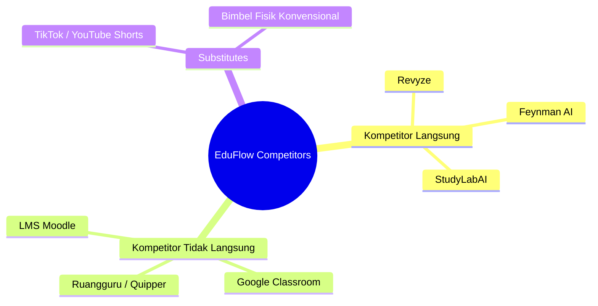
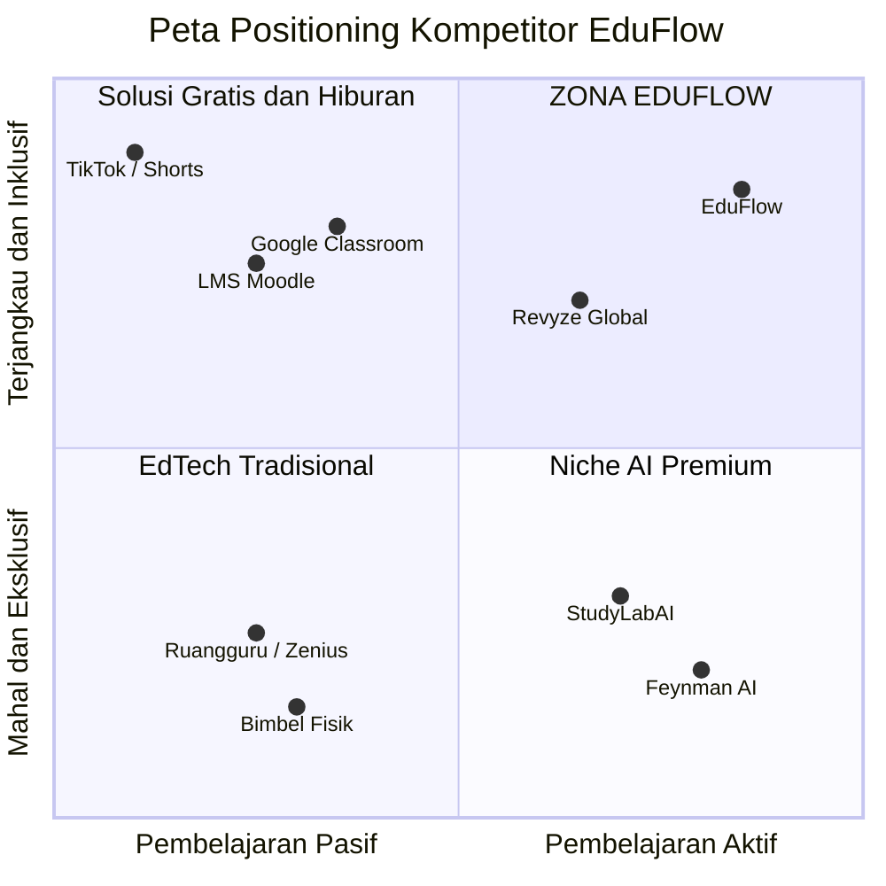

# 📊 ANALISIS KOMPETITOR & STRATEGI POSITIONING: EduFlow

Dokumen ini menyajikan analisis kompetitor secara mendalam (*deep competitor analysis*) serta peta posisi strategis (*strategic positioning*) untuk platform **EduFlow** guna menghadapi lanskap industri EdTech baik skala nasional maupun global.

---

## 👥 1. Klasifikasi & Analisis Kompetitor

EduFlow membagi kompetitornya menjadi tiga kategori utama untuk menyusun strategi pertahanan bisnis (*business moat*) yang kokoh:

### A. Kompetitor Langsung (*Direct Competitors*)
*Platform yang menyasar segmen usia yang sama dengan salah satu fitur utama (Microlearning video atau AI Voice Feynman).*

#### 1. [Revyze](https://www.revyze.com/) (AS / Prancis)
* **Deskripsi:** Aplikasi mobile *microlearning* berbasis umpan video pendek vertikal buatan komunitas siswa dan guru untuk jenjang SMP/SMA yang diselingi kuis interaktif.
* **Kenapa Menjadi Kompetitor:** Berbagi visi yang sama untuk membajak perilaku *doomscrolling* Gen Z menjadi aktivitas belajar video pendek vertikal.
* **Kelemahan yang Dieksploitasi EduFlow:** 
  - Evaluasi Revyze masih menggunakan kuis **Pilihan Ganda** konvensional yang rentan memicu ilusi pemahaman (*illusion of competence*).
  - Tidak memiliki saluran distribusi B2B formal yang terintegrasi dengan dana BOSP/BOS sekolah di Indonesia.

#### 2. [Feynman AI](https://feynmanai.net/) & [StudyLabAI](https://www.studylabai.com/) (Global)
* **Deskripsi:** Aplikasi seluler berbasis evaluasi lisan di mana siswa merekam penjelasan suara mereka, lalu kecerdasan buatan (AI) mendeteksi celah pemahaman konseptual.
* **Kenapa Menjadi Kompetitor:** Menggunakan inti metodologi evaluasi kognitif yang sama, yaitu **Teknik Feynman** berbasis rekaman suara (*voice note*).
* **Kelemahan yang Dieksploitasi EduFlow:**
  - Antarmuka mereka murni berbasis teks dan rekaman audio kering (sangat membosankan bagi siswa generasi digital).
  - Skema monetisasi murni B2C langganan bulanan dolar yang sangat mahal dan eksklusif.

---

### B. Kompetitor Tidak Langsung (*Indirect Competitors*)
*Raksasa EdTech lokal yang saat ini menguasai saluran distribusi sekolah dan anggaran pendidikan menengah di Indonesia.*

#### 1. Ruangguru, Quipper, & Zenius (Lokal Indonesia)
* **Deskripsi:** EdTech raksasa yang menguasai pasar konsumen individu (B2C) dan proyek digitalisasi sekolah pemerintah (B2B).
* **Kenapa Menjadi Kompetitor:** Menguasai pangsa pasar perhatian pelajar Indonesia dan anggaran pendidikan tahunan sekolah/orang tua.
* **Kelemahan yang Dieksploitasi EduFlow:**
  - Format pengajaran pasif satu arah (video berdurasi panjang 15-60 menit) yang memicu kejenuhan kognitif.
  - Tarif berlangganan B2C individu yang sangat mahal (jutaan rupiah per tahun) sehingga tidak inklusif.

#### 2. Google Classroom & LMS Moodle Gratisan
* **Deskripsi:** Sistem Manajemen Pembelajaran (*Learning Management System*) gratisan yang diadopsi massal oleh sekolah pasca-pandemi.
* **Kenapa Menjadi Kompetitor:** Digunakan sekolah negeri secara luas karena biaya lisensi Rp 0.
* **Kelemahan yang Dieksploitasi EduFlow:**
  - Tidak menyediakan kurikulum/konten otomatis (menuntut guru membuat soal dan materi sendiri secara manual).
  - Tidak memiliki kecerdasan buatan untuk mengevaluasi pemahaman lisan siswa secara otomatis.

---

### C. Kompetitor Pengganti (*Substitutes*)
*Aktivitas alternatif yang memperebutkan alokasi waktu layar (screentime) siswa dan anggaran saku orang tua.*

#### 1. TikTok, Instagram Reels, & YouTube Shorts
* **Deskripsi:** Platform hiburan umum yang memicu adiksi bergulir pasif non-akademis selama 3-4 jam sehari pada siswa Gen Z.
* **Kenapa Menjadi Kompetitor:** Bersaing langsung memperebutkan jatah perhatian (*attention share*) harian siswa di ponsel pintar.

#### 2. Jasa Les Privat & Bimbel Fisik (Ganesha Operation, Primagama, dll.)
* **Deskripsi:** Lembaga bimbingan belajar konvensional yang menyajikan pendampingan pengajar manusia secara tatap muka.
* **Kenapa Menjadi Kompetitor:** Menyerap anggaran pendidikan bulanan orang tua untuk kebutuhan pendampingan belajar interaktif.

---

## 🗺️ 2. Peta Posisi Strategis (*Competitive Positioning Map*)

Untuk membedakan posisi EduFlow secara radikal di hadapan juri dan investor, berikut adalah peta posisi strategis berdasarkan dua sumbu metrik utama:
1. **Sumbu Y (Metode Belajar):** Pembelajaran Aktif Verbal (Feynman Recall) vs. Pembelajaran Pasif Visual (Menonton Video/PDF).
2. **Sumbu X (Aksesibilitas Tarif):** Inklusif/Murah (Dana BOS Compliant) vs. Eksklusif/Mahal (High Price B2C).

### 💎 Analisis Kuadran Strategis:

1. **Kuadran Kanan-Atas (Aktif + Inklusif) — ★ Zona Eksklusif EduFlow:**
   - EduFlow memimpin kuadran ini sendirian. Kami adalah satu-satunya platform yang menawarkan **evaluasi lisan Feynman AI** (Aktif) secara massal dan gratis bagi siswa karena disubsidi oleh model **B2B Flat-Rate Dana BOS** dan **B2C Iklan** (Inklusif).
2. **Kuadran Kiri-Atas (Aktif + Mahal) — Feynman AI / StudyLabAI:**
   - Teknologi kognitifnya sangat baik (Aktif), tetapi terhambat oleh harga langganan dollar yang mahal (Eksklusif) dan visualisasi yang membosankan.
3. **Kuadran Kiri-Bawah (Pasif + Mahal) — Ruangguru & Bimbel Fisik:**
   - Menyajikan materi belajar satu arah (Pasif) dengan biaya tahunan bernilai jutaan rupiah (Mahal) yang memperlebar jurang kesenjangan sosial-ekonomi.
4. **Kuadran Kanan-Bawah (Pasif + Inklusif) — Google Classroom & TikTok:**
   - Murah/Gratis (Inklusif), tetapi proses belajarnya pasif dan tidak memiliki sistem asesmen cerdas otomatis yang meringankan tugas guru.

---

## 🛡️ 3. Tiga Pilar Pertahanan Strategis (*EduFlow Competitive Moats*)

EduFlow tidak bersaing dalam perang harga (*price war*) dengan raksasa EdTech, melainkan membangun parit pertahanan yang tidak bisa ditembus oleh kompetitor:

### 1. Parit Teknologi (*Cognitive Tech Moat*)
* Kami menyatukan adiksi umpan video vertikal pendek (seperti Revyze) dengan keharusan asesmen suara Feynman AI (seperti Feynman AI). Konvergensi ini **belum pernah diterapkan oleh kompetitor EdTech mana pun di Asia Tenggara**.

### 2. Parit Kebijakan & Distribusi (*B2B SIPLah Moat*)
* Kompetitor global tidak memiliki akses hukum ke dana BOS sekolah Indonesia. Sementara kompetitor lokal tidak menawarkan skema **Tiered Flat-Rate murah (mulai Rp 400.000/bulan)** via SIPLah. EduFlow memotong jalur akuisisi siswa secara masif lewat SE rekomendasi dinas pendidikan daerah.

### 3. Parit Arsitektur Biaya (*Cost Structure Moat*)
* Berkat Whisper STT lokal, OpenRouter Gemini Flash (Rp 97/evaluasi), dan Bunny Stream (60× lebih hemat dari Cloudflare), HPP kita sangat rendah. Struktur biaya super hemat ini membuat kita **bisa menawarkan harga inklusif yang tidak akan mungkin bisa dicocokkan oleh kompetitor besar** yang memiliki beban gaji karyawan dan biaya cloud raksasa.

---

## 📚 Dokumen Terkait:
- [MARKET_SIZE.md](file:///c:/laragon/www/project1/MARKET_SIZE.md) - Analisis Ukuran Pasar TAM, SAM, SOM
- [BMC.md](file:///c:/laragon/www/project1/BMC.md) - Kanvas Model Bisnis
