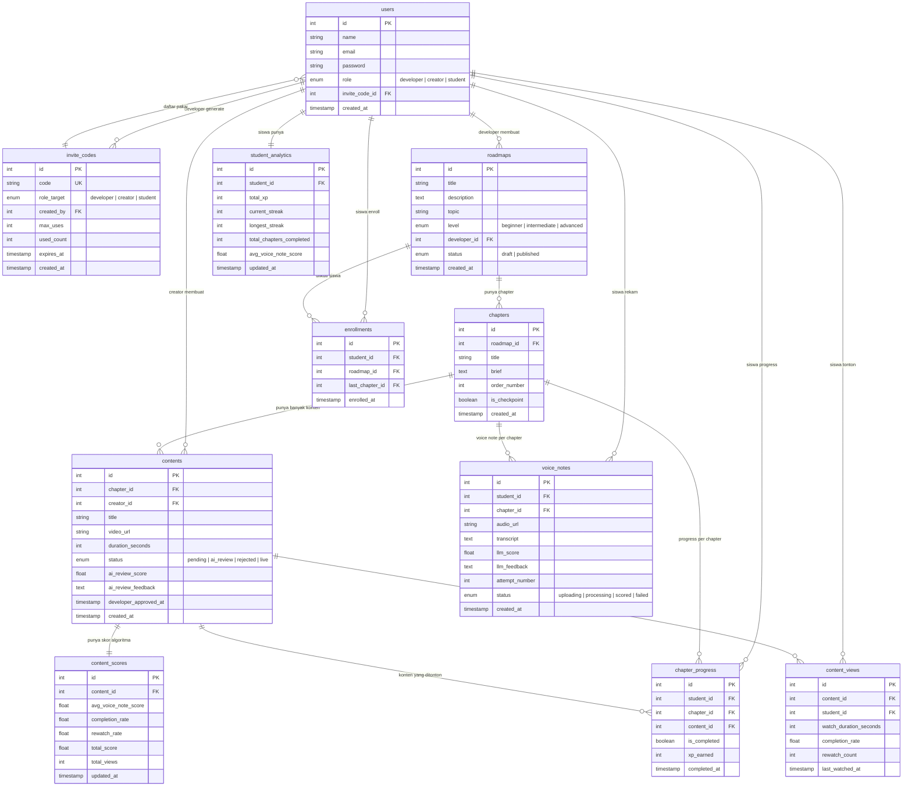

# 🗄️ ERD — EduFlow Database Design

> Desain database untuk platform pembelajaran EduFlow.
> Dibuat berdasarkan 9 diagram alur sistem.

---

## 📋 Daftar Tabel

| Tabel | Deskripsi |
|---|---|
| `users` | Semua pengguna (developer, creator, siswa) |
| `invite_codes` | Kode undangan untuk registrasi beta |
| `roadmaps` | Kurikulum/roadmap yang dibuat developer |
| `chapters` | Setiap chapter dalam roadmap |
| `contents` | Video konten per chapter dari creator |
| `content_scores` | Skor algoritma TikTok per konten |
| `content_views` | Tracking tonton siswa per konten |
| `enrollments` | Siswa yang enroll ke roadmap |
| `chapter_progress` | Progress siswa per chapter |
| `voice_notes` | Rekaman voice note siswa |
| `student_analytics` | XP, streak, statistik keseluruhan siswa |

---

## 🔗 ERD Diagram

---

## 📐 Detail Tabel

### `users`
| Kolom | Tipe | Keterangan |
|---|---|---|
| `id` | INT PK | Primary key |
| `name` | VARCHAR(100) | Nama lengkap |
| `email` | VARCHAR(100) UNIQUE | Email login |
| `password` | VARCHAR(255) | Hashed bcrypt |
| `role` | ENUM | `developer`, `creator`, `student` |
| `invite_code_id` | INT FK | Kode undangan yang dipakai saat daftar |
| `created_at` | TIMESTAMP | Waktu registrasi |

---

### `invite_codes`
| Kolom | Tipe | Keterangan |
|---|---|---|
| `id` | INT PK | Primary key |
| `code` | VARCHAR(20) UNIQUE | Kode unik |
| `role_target` | ENUM | Role yang diberikan saat pakai kode ini |
| `created_by` | INT FK | Developer yang generate |
| `max_uses` | INT | Maksimal pemakaian (0 = unlimited) |
| `used_count` | INT | Sudah dipakai berapa kali |
| `expires_at` | TIMESTAMP | Batas waktu berlaku |
| `created_at` | TIMESTAMP | Waktu dibuat |

---

### `roadmaps`
| Kolom | Tipe | Keterangan |
|---|---|---|
| `id` | INT PK | Primary key |
| `title` | VARCHAR(150) | Judul roadmap |
| `description` | TEXT | Deskripsi roadmap |
| `topic` | VARCHAR(100) | Topik (programming, design, dll) |
| `level` | ENUM | `beginner`, `intermediate`, `advanced` |
| `developer_id` | INT FK | Developer pembuat |
| `status` | ENUM | `draft`, `published` |
| `created_at` | TIMESTAMP | Waktu dibuat |

---

### `chapters`
| Kolom | Tipe | Keterangan |
|---|---|---|
| `id` | INT PK | Primary key |
| `roadmap_id` | INT FK | Roadmap induk |
| `title` | VARCHAR(150) | Judul chapter |
| `brief` | TEXT | Brief untuk creator (apa yang harus diajarkan) |
| `order_number` | INT | Urutan chapter dalam roadmap |
| `is_checkpoint` | BOOLEAN | Apakah chapter ini wajib voice note |
| `created_at` | TIMESTAMP | Waktu dibuat |

---

### `contents`
| Kolom | Tipe | Keterangan |
|---|---|---|
| `id` | INT PK | Primary key |
| `chapter_id` | INT FK | Chapter yang dituju |
| `creator_id` | INT FK | Creator pembuat |
| `title` | VARCHAR(150) | Judul video |
| `video_url` | VARCHAR(255) | URL video (Cloudflare/S3) |
| `duration_seconds` | INT | Durasi video |
| `status` | ENUM | `pending`, `ai_review`, `rejected`, `live` |
| `ai_review_score` | FLOAT | Skor dari AI moderasi |
| `ai_review_feedback` | TEXT | Feedback AI jika ditolak |
| `developer_approved_at` | TIMESTAMP | Waktu approval developer |
| `created_at` | TIMESTAMP | Waktu upload |

---

### `content_scores` *(Algoritma TikTok)*
| Kolom | Tipe | Keterangan |
|---|---|---|
| `id` | INT PK | Primary key |
| `content_id` | INT FK UNIQUE | Relasi 1-to-1 dengan contents |
| `avg_voice_note_score` | FLOAT | Rata-rata skor voice note siswa (0–100) |
| `completion_rate` | FLOAT | Rata-rata siswa nonton sampai selesai (0–1) |
| `rewatch_rate` | FLOAT | Rata-rata siswa nonton ulang (0–1) |
| `total_score` | FLOAT | `70%×VN + 20%×CR + 10%×RR` |
| `total_views` | INT | Total tayangan |
| `updated_at` | TIMESTAMP | Terakhir diupdate |

---

### `voice_notes`
| Kolom | Tipe | Keterangan |
|---|---|---|
| `id` | INT PK | Primary key |
| `student_id` | INT FK | Siswa yang merekam |
| `chapter_id` | INT FK | Chapter yang dijelaskan |
| `audio_url` | VARCHAR(255) | URL file audio di S3 |
| `transcript` | TEXT | Hasil transkripsi Whisper |
| `llm_score` | FLOAT | Skor pemahaman dari LLM (0–100) |
| `llm_feedback` | TEXT | Feedback dari LLM |
| `attempt_number` | INT | Percobaan ke-berapa |
| `status` | ENUM | `uploading`, `processing`, `scored`, `failed` |
| `created_at` | TIMESTAMP | Waktu rekam |

---

### `student_analytics`
| Kolom | Tipe | Keterangan |
|---|---|---|
| `id` | INT PK | Primary key |
| `student_id` | INT FK UNIQUE | Relasi 1-to-1 dengan users |
| `total_xp` | INT | Total XP yang dikumpulkan |
| `current_streak` | INT | Streak belajar saat ini (hari) |
| `longest_streak` | INT | Streak terpanjang yang pernah dicapai |
| `total_chapters_completed` | INT | Total chapter yang diselesaikan |
| `avg_voice_note_score` | FLOAT | Rata-rata skor voice note keseluruhan |
| `updated_at` | TIMESTAMP | Terakhir diupdate |

---

## 🔑 Catatan Desain

> **1 Chapter → Banyak Content (Multiple Creator)**
> Relasi `chapters` → `contents` adalah **one-to-many**.
> Algoritma di `content_scores` yang menentukan konten mana yang ditampilkan ke siswa tertentu.

> **Voice Note = Kunci Unlock**
> Siswa hanya bisa lanjut chapter berikutnya setelah `voice_notes.llm_score` mencapai threshold yang ditentukan developer di checkpoint.

> **Idempotent Analytics**
> `student_analytics` di-update setiap kali siswa menyelesaikan chapter — bukan di-insert baru.
