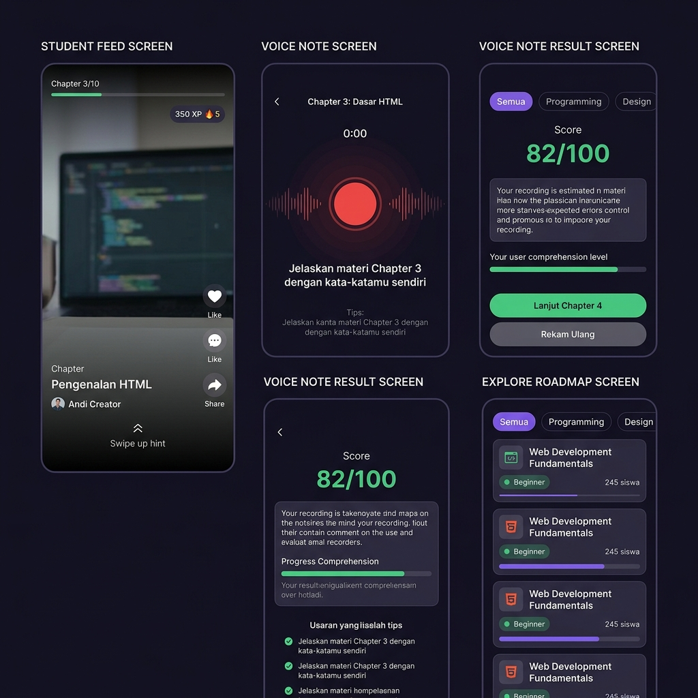
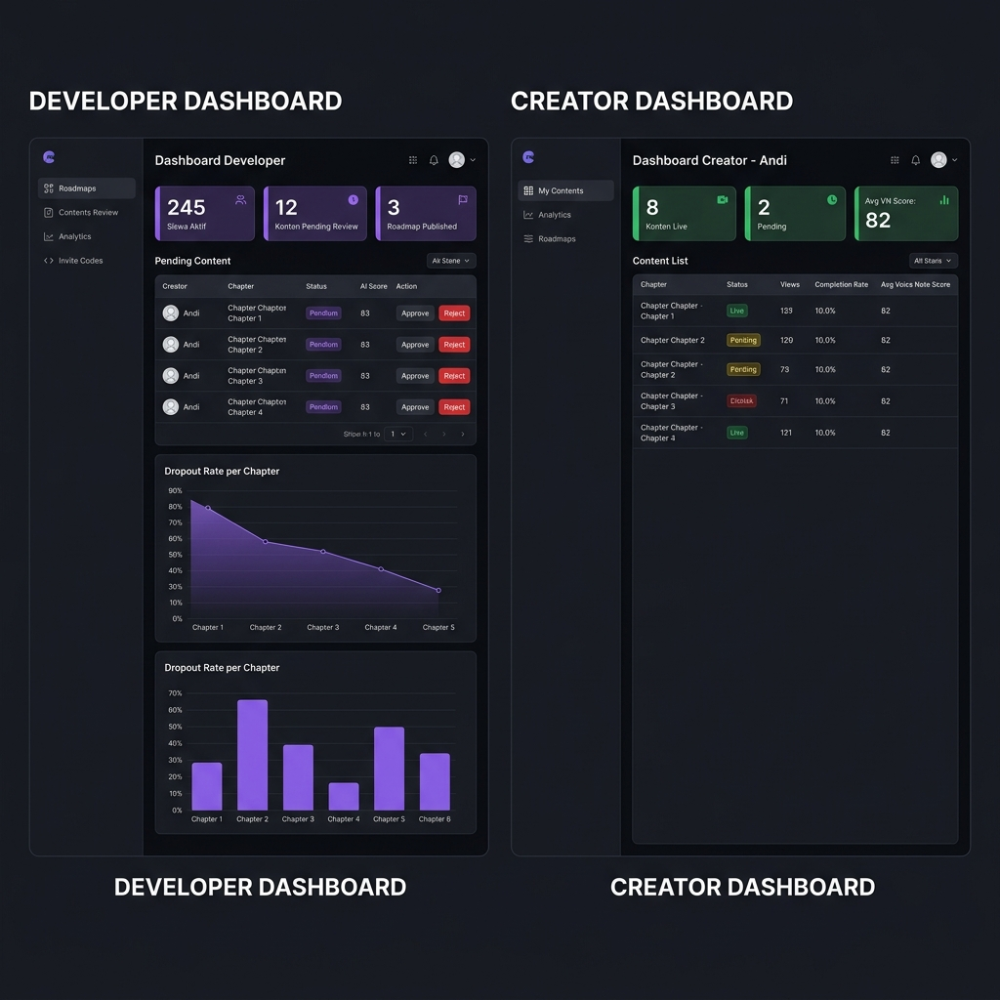
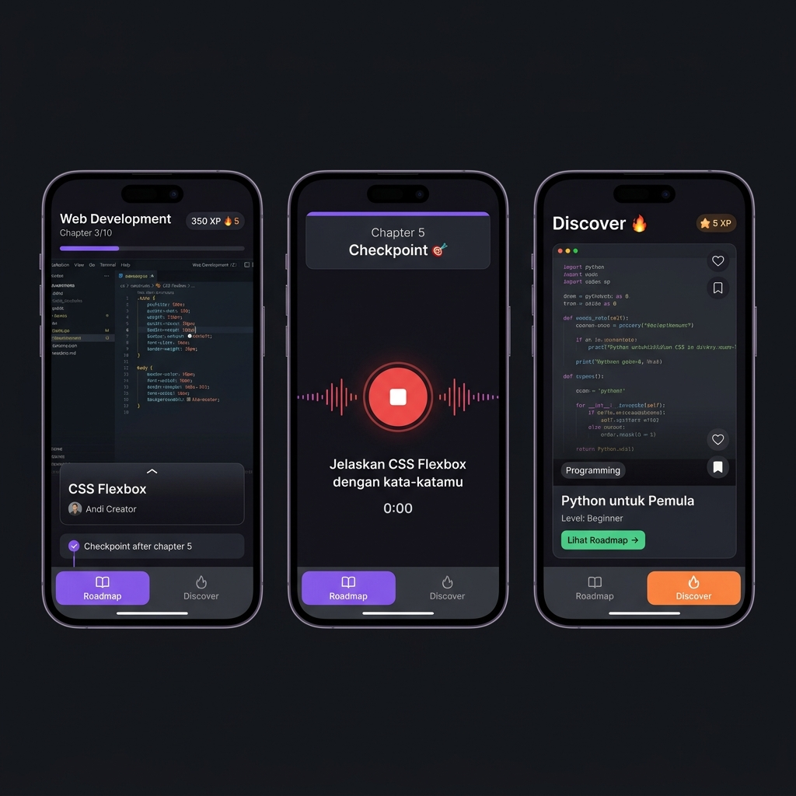

# 🎨 WIREFRAME — EduFlow UI Design

> Referensi visual untuk Dev 2 (Frontend) dalam membangun tampilan aplikasi.
> Gunakan wireframe ini sebagai konteks saat prompt ke AI untuk generate kode UI.

---

## 🖼️ Preview Wireframe

### Mobile — Student Screens


### Web Admin — Developer & Creator Dashboard


### Mobile — Dual Navigation (Roadmap vs Discover)


---


## 📱 Mobile App — Student Screens

### Screen 1: Feed Belajar (TikTok-style)
**File:** `mobile/src/screens/student/FeedScreen.tsx`

**Elemen yang harus ada:**
- Full screen video player (vertikal)
- Overlay gelap di bawah dengan info chapter
- Progress chapter di atas: `Chapter 3 / 10`
- XP counter kanan atas: `350 XP 🔥5`
- Nama chapter & creator di bawah
- Tombol swipe up untuk lanjut
- Tombol side kanan: bookmark

**Behavior:**
- Swipe UP → chapter berikutnya
- Video autoplay saat masuk
- Pause saat swipe / background

---

### Screen 2: Voice Note Recording
**File:** `mobile/src/screens/student/VoiceNoteScreen.tsx`

**Elemen yang harus ada:**
- Teks instruksi: *"Jelaskan materi Chapter 3 dengan kata-katamu sendiri"*
- Tombol rekam bulat besar (merah) di tengah
- Animasi waveform saat merekam
- Timer rekaman: `0:23`
- Tombol stop & kirim
- Tips singkat: *"Tidak perlu sempurna — jelaskan seperti ke teman"*

**Behavior:**
- Tap tombol → mulai rekam
- Tap lagi → stop
- Konfirmasi sebelum kirim

---

### Screen 3: Hasil Voice Note
**File:** `mobile/src/screens/student/VoiceNoteResultScreen.tsx`

**Elemen yang harus ada:**
- Skor besar: `82 / 100` (warna hijau jika lulus, merah jika belum)
- Label: `Pemahaman Cukup ✅` / `Belum Cukup ❌`
- Feedback teks dari LLM
- Progress bar pemahaman
- Tombol: `Lanjut Chapter 4` (jika lulus) / `Rekam Ulang` (jika belum)

---

### Screen 4: Explore Roadmap
**File:** `mobile/src/screens/student/ExploreScreen.tsx`

**Elemen yang harus ada:**
- Search bar di atas
- Filter tabs: `Semua | Programming | Design | dll`
- Card per roadmap berisi:
  - Ikon topik
  - Judul roadmap
  - Badge level: `Beginner / Intermediate / Advanced`
  - Total siswa: `245 siswa`
  - Progress bar (kalau sudah enrolled)
  - Tombol `Mulai` / `Lanjutkan`

---

## 🌐 Web Admin — Dashboard Screens

### Screen 5: Developer Dashboard
**File:** `admin/app/(developer)/page.tsx`

**Elemen yang harus ada:**
- Sidebar navigasi: Roadmaps, Content Review, Analytics, Invite Codes
- Stats cards:
  - Siswa Aktif
  - Konten Pending Review
  - Roadmap Published
- Tabel konten pending: Creator, Chapter, AI Score, Tombol Approve/Reject
- Grafik dropout rate per chapter

---

### Screen 6: Creator Dashboard
**File:** `admin/app/(creator)/page.tsx`

**Elemen yang harus ada:**
- Sidebar navigasi: My Contents, Analytics, Roadmaps
- Stats cards:
  - Konten Live
  - Konten Pending
  - Avg Voice Note Score siswa
- Tabel konten:
  - Chapter
  - Status badge (Live / Pending / Ditolak)
  - Views
  - Completion Rate
  - Avg VN Score
- Klik "Ditolak" → lihat feedback AI + developer

---

## 🎨 Design System

### Warna Utama

```
Background Utama   : #0F0F0F (hitam gelap)
Background Card    : #1A1A1A
Background Overlay : rgba(0,0,0,0.7)

Aksen Ungu (Developer) : #6B4C8A
Aksen Hijau (Creator)  : #2D6A4F
Aksen Oranye (Siswa)   : #D97706
Aksen Merah (Error)    : #8B1A1A

Teks Utama     : #FFFFFF
Teks Secondary : #A3A3A3
Border         : #2A2A2A
```

### Font

```
Font Utama  : Inter (Google Fonts)
Heading     : Inter Bold (700)
Body        : Inter Regular (400)
Caption     : Inter Medium (500)
```

### Ukuran Teks

```
H1 : 28px
H2 : 22px
H3 : 18px
Body : 14px
Caption : 12px
```

### Border Radius

```
Button   : 12px
Card     : 16px
Badge    : 999px (pill)
Input    : 10px
```

---

## 💡 Tips Prompt ke AI untuk Generate UI

Saat minta AI buatkan komponen, gunakan template ini:

```
Buatkan [nama komponen] untuk React Native / Next.js dengan:
- Warna background: #0F0F0F, aksen: #6B4C8A
- Font: Inter dari Google Fonts
- Elemen: [list elemen dari wireframe di atas]
- Data dari API: [paste format response dari API.md]
- Behavior: [jelaskan interaksi]
```

**Contoh prompt:**
```
Buatkan FeedScreen.tsx untuk React Native dengan:
- Background hitam fullscreen
- Video player fullscreen menggunakan expo-video
- Aksen warna ungu #6B4C8A
- Overlay bawah: chapter title, creator name, swipe hint
- XP counter kanan atas: "350 XP 🔥5"
- Progress chapter atas: "3/10"
- Swipe up gesture untuk next chapter
- Data chapter dari API response: { content_id, title, video_url, creator.name }
```
