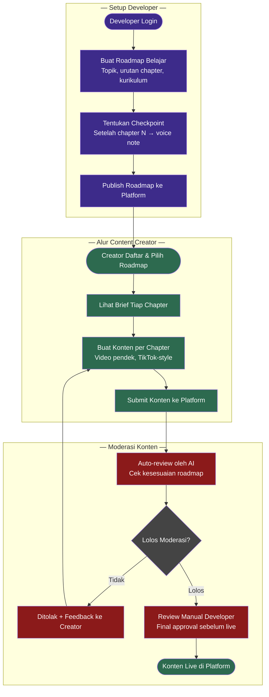
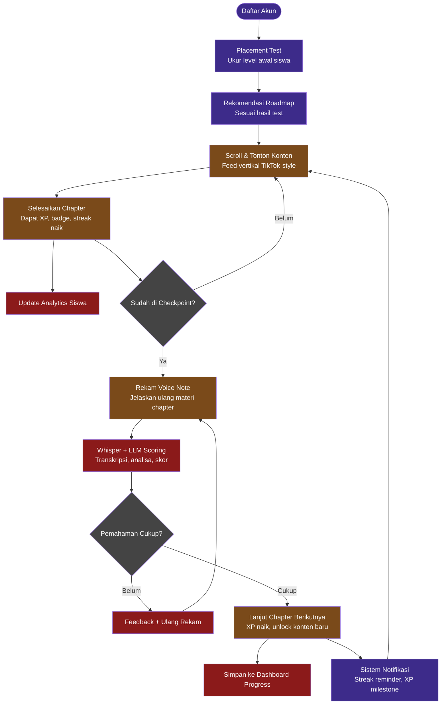
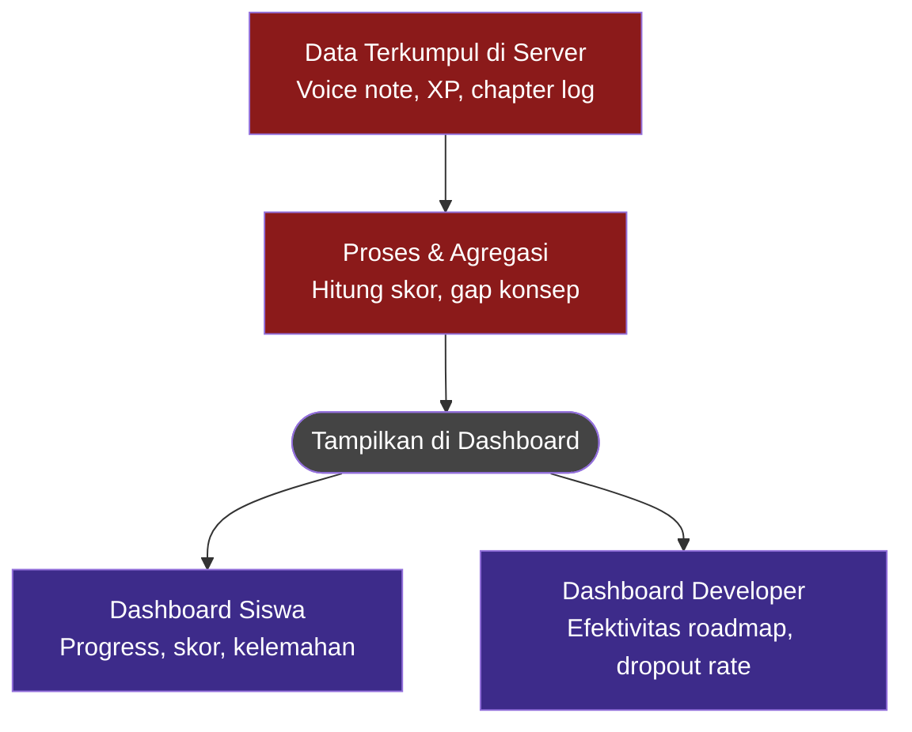
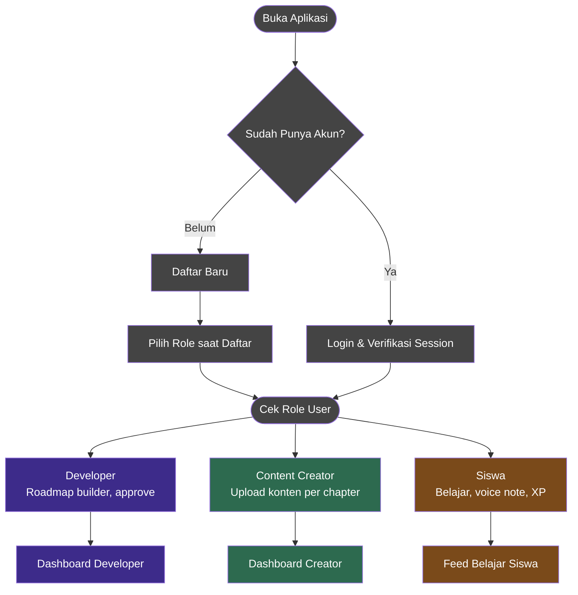
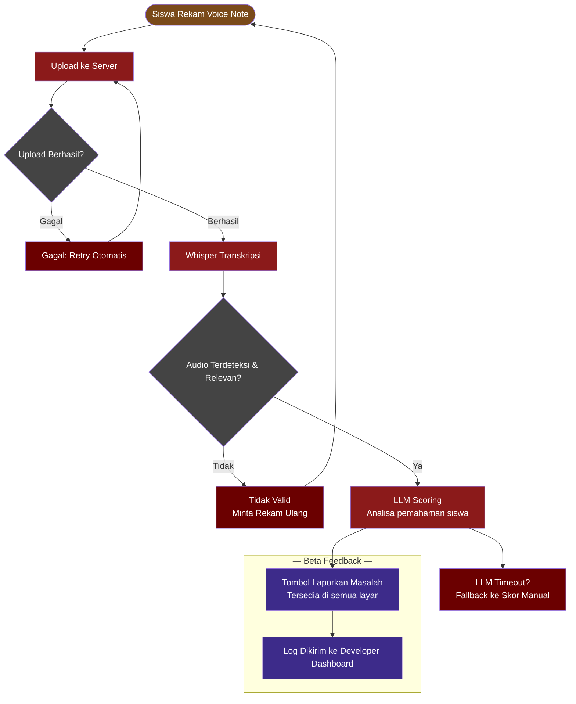
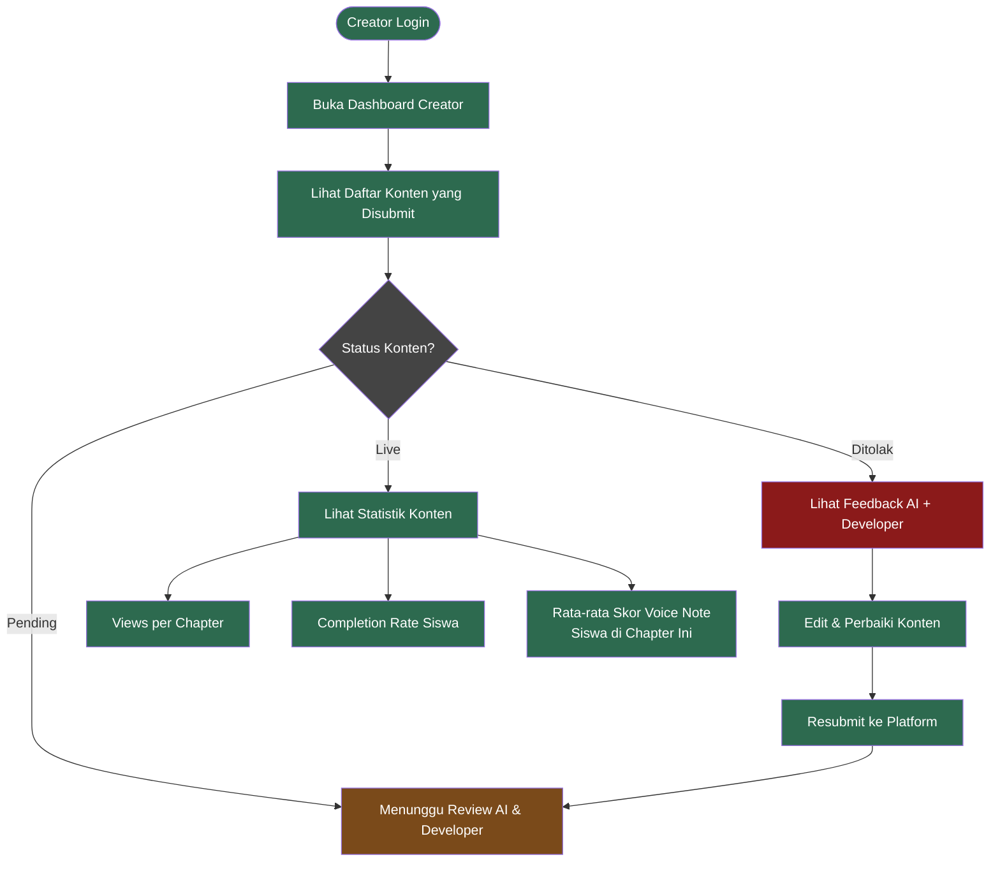
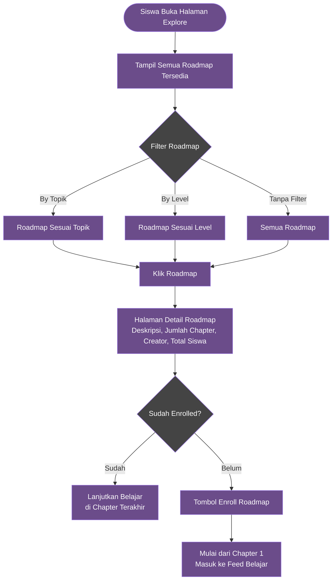
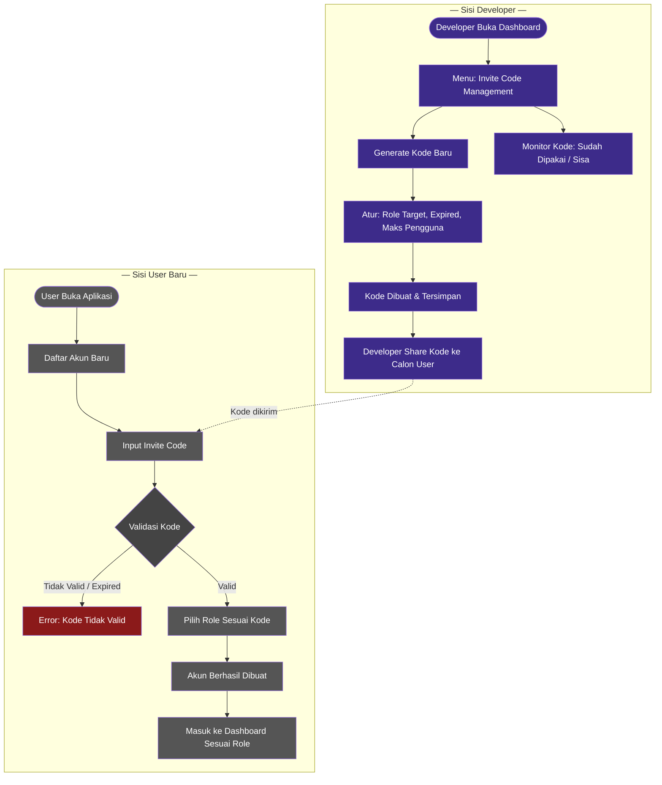
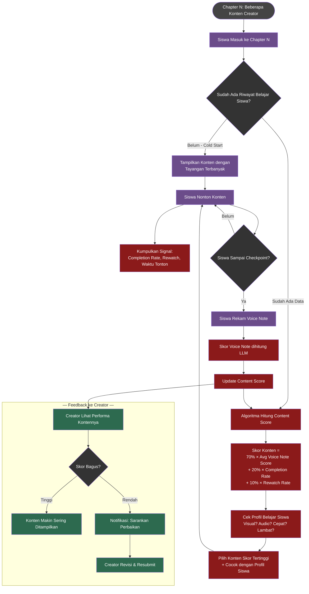

# 📚 EduFlow — Platform Pembelajaran Berbasis AI

> Gabungan TikTok scrolling + Duolingo gamifikasi + Feynman Technique untuk verifikasi pemahaman siswa via voice note yang dianalisis AI.

---

## 🎯 Konsep & Visi

Platform pembelajaran di mana:
- **Developer** membuat roadmap kurikulum resmi
- **Content Creator** membuat video pendek per chapter (wajib sesuai roadmap)
- **Siswa** belajar via feed TikTok-style, diukur pemahamannya dengan voice note yang dianalisis AI

---

## 👥 Tiga Peran dalam Sistem

| Role | Akses | Tugas Utama |
|---|---|---|
| **Developer** | Dashboard developer | Buat & publish roadmap, review konten final |
| **Content Creator** | Dashboard creator | Upload video per chapter sesuai brief |
| **Siswa** | Feed belajar | Scroll konten, selesaikan chapter, rekam voice note |

> ⚠️ **Beta:** Semua role hanya bisa daftar dengan invite code dari developer.

---

## 📊 Diagram Alur Sistem

---

### Diagram 1 — Setup Developer + Moderasi Konten Creator



---

### Diagram 2 — Alur Belajar Siswa



---

### Diagram 3 — Analytics & Dashboard



---

### Diagram 4 — Auth & Role System



> 📌 **Beta:** Invite-only — hanya user dengan kode undangan yang bisa daftar.

---

### Diagram 5 — Error Handling Voice Note



---

### Diagram 6 — Creator Dashboard Detail



---

### Diagram 7 — Roadmap Discovery untuk Siswa



---

### Diagram 8 — Manajemen Invite Code



---

### Diagram 9 — Content Selection Algorithm (TikTok-style)

> Satu chapter bisa diisi banyak creator. Algoritma memilih konten berdasarkan **skor pemahaman**, bukan sekadar engagement.



#### 📊 Formula Content Score

| Bobot | Metrik | Keterangan |
|---|---|---|
| **70%** | Avg Voice Note Score | Seberapa paham siswa setelah nonton konten ini |
| **20%** | Completion Rate | Apakah siswa menonton sampai selesai |
| **10%** | Rewatch Rate | Apakah siswa menonton ulang |

> ⚠️ Algoritma hanya memilih **SIAPA creator** yang mengajarkan chapter. Urutan chapter tetap dikontrol developer.

---

## 🛠️ Tech Stack

### Backend
| Layer | Teknologi | Alasan |
|---|---|---|
| **Framework** | Laravel (PHP) | Sesuai environment Laragon, ekosistem lengkap |
| **Database** | MySQL | Sudah tersedia di Laragon |
| **Cache / Queue** | Redis | Async processing voice note & content scoring |
| **Auth** | Laravel Sanctum | API token untuk mobile |

### Frontend / Mobile
| Platform | Teknologi | Alasan |
|---|---|---|
| **Mobile App** | React Native | TikTok-style swipe, cross-platform iOS & Android |
| **Web Admin** | Next.js | Dashboard developer & creator |

### AI & Storage
| Kebutuhan | Teknologi | Alasan |
|---|---|---|
| **Speech-to-Text** | OpenAI Whisper API | Transkripsi voice note siswa |
| **LLM Scoring** | OpenAI GPT-4o | Analisa pemahaman dari transkrip |
| **Video Storage** | Cloudflare Stream / S3 | Streaming video TikTok-style |
| **Audio Storage** | AWS S3 | Simpan file voice note |

### DevOps (Beta)
| Kebutuhan | Teknologi |
|---|---|
| **Server** | VPS (DigitalOcean / Hetzner) |
| **Containerisasi** | Docker |
| **CI/CD** | GitHub Actions |

---

## 🎯 Scope Beta

### ✅ Fitur Wajib Ada
- [ ] Auth & invite code system
- [ ] Developer: buat & publish roadmap + chapter
- [ ] Creator: upload video per chapter + melihat status konten
- [ ] Moderasi konten: AI review + developer approval
- [ ] Siswa: enroll roadmap, feed TikTok-style, XP & streak
- [ ] Checkpoint voice note + Whisper + LLM scoring
- [ ] Roadmap discovery (browse + filter)
- [ ] Creator dashboard (status + statistik basic)
- [ ] Error handling voice note (retry, fallback)
- [ ] Content selection algorithm (TikTok-style)
- [ ] Analytics dashboard (siswa & developer)

### ❌ Skip untuk Beta
- Monetisasi / payment
- Social / komentar
- Offline mode
- Roadmap versioning
- Placement test detail

---

### Diagram 10 — Dual Navigation Mode (Roadmap vs Discover)

> **Konsep:** Bottom navigation bar dibagi 2 mode utama.
> Mirip TikTok "Following" vs "For You" — siswa bisa switch antara belajar terstruktur dan konten acak saat bosan.

```mermaid
flowchart TD
    A([Siswa Buka App]) --> B[Bottom Navigation Bar]

    B --> C[\ud83d\udcda Tab: ROADMAP\nBelajar Terstruktur]
    B --> D[\ud83d\udd25 Tab: DISCOVER\nKonten Random]

    subgraph ROADMAP_MODE [" \u2014 Mode Roadmap (Terstruktur) \u2014 "]
        C --> C1[Lanjutkan dari Chapter Terakhir\nUrutan wajib sesuai roadmap]
        C1 --> C2[Tonton Video Chapter N]
        C2 --> C3[Selesaikan Chapter\nDapat XP + Streak]
        C3 --> C4{Sudah di Checkpoint?}
        C4 -->|Belum| C2
        C4 -->|Ya| C5[Wajib Voice Note\nSebelum Lanjut Chapter]
        C5 --> C6[Unlock Chapter Berikutnya]
    end

    subgraph DISCOVER_MODE [" \u2014 Mode Discover (Santai) \u2014 "]
        D --> D1[Algoritma Pilih Konten Acak\nDari Semua Roadmap Published]
        D1 --> D2[Filter Otomatis:\nSesuai Level Siswa]
        D2 --> D3[Tonton Video Apapun\nSwipe Up untuk Skip]
        D3 --> D4[Dapat XP Kecil\nTanpa Checkpoint]
        D4 --> D5{Tertarik dengan\nTopik Ini?}
        D5 -->|Ya| D6[Tombol: Lihat Roadmap Ini\nLangsung ke Detail Roadmap]
        D5 -->|Tidak| D3
        D6 --> D7[Enroll Roadmap Baru\nLanjut di Tab Roadmap]
    end

    C5 -.->|Bosan? Switch mode| D
    D -.->|Mau lanjut belajar?| C

    style A fill:#444,color:#fff
    style B fill:#333,color:#fff
    style C fill:#3d2b8a,color:#fff
    style D fill:#7a4a1a,color:#fff
    style C1 fill:#3d2b8a,color:#fff
    style C2 fill:#3d2b8a,color:#fff
    style C3 fill:#3d2b8a,color:#fff
    style C4 fill:#333,color:#fff
    style C5 fill:#8b1a1a,color:#fff
    style C6 fill:#3d2b8a,color:#fff
    style D1 fill:#7a4a1a,color:#fff
    style D2 fill:#8b1a1a,color:#fff
    style D3 fill:#7a4a1a,color:#fff
    style D4 fill:#7a4a1a,color:#fff
    style D5 fill:#333,color:#fff
    style D6 fill:#2d6a4f,color:#fff
    style D7 fill:#2d6a4f,color:#fff
```

#### 🔑 Perbedaan Utama Dua Mode

| | Tab Roadmap 📚 | Tab Discover 🔥 |
|---|---|---|
| **Urutan konten** | Wajib berurutan (bab 1, 2, 3...) | Acak, bebas |
| **Voice note** | ✅ Wajib di checkpoint | ❌ Tidak ada |
| **XP** | Besar (50 XP/chapter) | Kecil (5 XP/video) |
| **Tujuan** | Selesaikan kurikulum | Eksplorasi & refreshing |
| **Bisa enroll baru?** | Tidak langsung | ✅ Dari tombol di video |
| **Algoritma** | Urutan ditentukan developer | TikTok-style content score |

#### 💡 Kenapa Ini Bagus untuk Retention

```
Tanpa Discover mode:
  Siswa bosan dengan roadmap → keluar dari app → churn

Dengan Discover mode:
  Siswa bosan dengan roadmap
    → switch ke Discover
    → nonton video santai
    → mungkin tertarik topik baru
    → enroll roadmap baru
    → kembali ke Tab Roadmap
    → tetap aktif di platform ✅
```

> ⚠️ **Catatan Implementasi:**
> - Konten di Discover **hanya dari roadmap yang sudah published**
> - Filter berdasarkan level siswa (hasil placement test)
> - **Tidak menggantikan** checkpoint voice note di Tab Roadmap
> - Streak hanya naik kalau belajar di **Tab Roadmap**

---

> 📄 **ERD Database** → lihat file `ERD.md`
